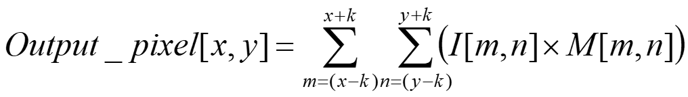
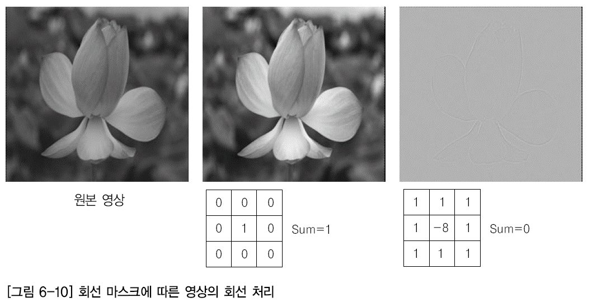
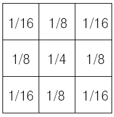
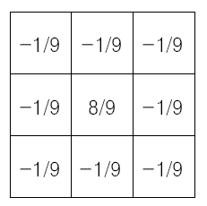
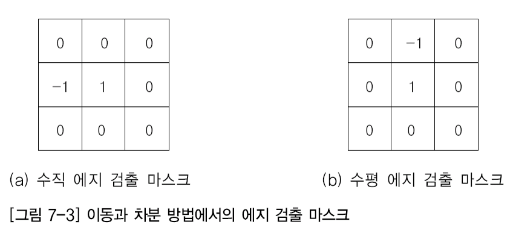
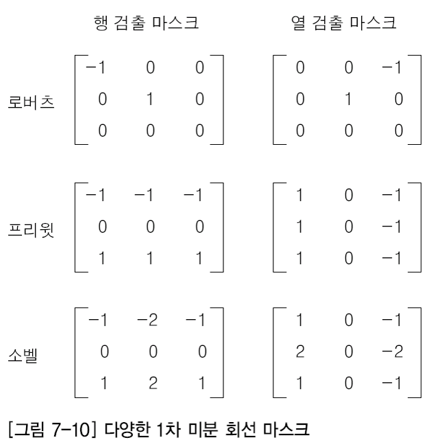
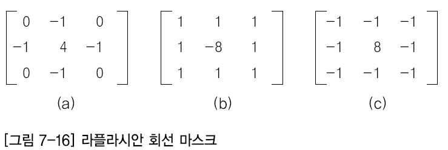
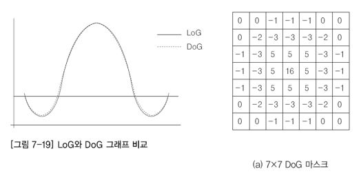

# 디지털 영상처리

(200106)

## 01장. 디지털 영상처리 개요

#### 디지털 영상 개선

-하는 기술 : 평활화(Equalization), 첨예화(Sharpening), 잡음제거 등

#### 디지털 영상 복원

#### 디지털 영상 분석

: 기계가 분석하기 쉬운 형태로 영상을 변환

low-level vision

고주파 성분=edge

#### 디지털 영상 인식

: 객체나 형상에서 주요 속성을 추출하여 식별할 수 있는 클래스나 카테고리로 분류하는 기술

디지털 영상 입력, 전처리, 영상 분할, 특징 추출, 인식의 처리 단계 ...

지문인식, 얼굴(앞으로 해야 할 분야)

#### 디지털 영상 압축

무손실 압축 / 손실 압축

​	png / jpeg (색상정보)

우리나라는 거의 표준화되어있어서 연구X


* 화소 점 처리 (point processing) : 산술연산(밝게), 논리연산

* 영역 처리 (area processing) : bluring, sharpening

* 기하학 처리(geometric processing) : scale, rotation, translation

DNN:1차원 / CNN:2차원 이상.

분석할 차원이 20만.. 이미지 분석 시 차원이 많이 필요(이미지 많이 필요) -> 스케일만 변경해도 데이터 뻥튀기 가능

* 프레임 처리

두 개 이상의 서로 다른 디지털 영상으로 각종 연산 등을 조합하여 새로운 화소 값을 생성하는 것

object detection : 꽃이 여기에 있습니다

object segmentation : 이렇게 되어있는 부분이 꽃이에요 (masking)


## 실습

openCV : 영상 처리 쉽게 할 수 있는 image processing library

gpu 있어야 처리 빠른데


#### OpenCV 설치

```bash
pip install opencv-python==버전
```


주피터 노트북 열기 (서버는 실행중)

127.0.0.1 = localhost

127.0.0.1:8888

token 입력

## 02장. 디지털 영상

### 01. 빛과 색, 시각

* 컬러 디지털 영상 : 색 정보를 3 지각변수(색상,채도,명도)로 인식

사람의 인지 체계는 색상+채도=색도(Chromaticity)

* 흑백 디지털 영상 : 이진영상, grey-level 영상

### 02. 컬러모델

RGB, CMY(K), HSI, YCrCb, YUV ...

많이 쓰는 색상 체계 : RGB

0-255 : 1 byte = 8 bit

2^8=256

색상을 표현하는데 R 채널, G채널, B 채널 총 3 byte가 필요

컴퓨터는 색상수가 정해져 있어. Truecolor (1600만 개)

32bit(기본 integer 범위가 32bit) = 42억

각 값을 넘어가면 overflow (값을 올렸는데 어두워져)


numpy : 연산속도 빠름

#### CMY

기본색: Cyan, magenta, Yellow

RGB 컬러 모델에서 대각선으로 마주보는 색의 모양을 서로 바꿔놓은 것처럼 보임

#### HSI

Hue(색상), Saturation(채도), Intensity(명도)

#### YCrCb

명도에 더 민감한 인간의 눈을 감안해 모델 개발

명도 Y, 푸른색 Cr, 붉은색 Cb

눈에 민감한 명도 Y는 유지, 안 민감한 Cr, Cb 색상정보는 줄여 사용

정지영상 압축 표준 방식인 JPEG과 동영상 압축 MPEG

#### YIQ, YUV

YCrCb 컬러 모델과 유사


(200107)

### 통계

#### Data 학습, 모델, 예측

* 다음 숫자 예측?

  평균으로 예측하는 것이 합리적? 확률적으로 대답 가능

* 크로마키 이미지에서 배경 제거하는 문제를

  하나의 값이 아닌, 정규분포를 이용할 수 있음


### 03. 디지털 영상의 생성


### 04.디지털 영상의 종류


## 04장. 화소 점 처리

### 02. 산술연산

* 덧셈연산: 명도 값을 증가시켜 밝게, 히스토그램의 기둥이 오른쪽으로 이동
* 뺄셈연산: 명도 값을 감소시켜 어둡게, 히스토그램의 기둥이 왼쪽으로 이동
* 곱셈연산: 명암 대비가 증가하여 히스토그램은 기둥의 분포 범위가 넓음
* 나눗셈연산: 명암 대비가 감소하여 히스토그램의 분포 범위가 좁음. 
* => 선형 연산

2차원에서의 선형 :  1차원

#### 산술연산의 문제점 해결 방법

클래핑(Clamping) : 최저/최대값 0~255 벗어나지 않도록

랩핑(Wraping) : 최댓값 + 1 = 최솟값

=> 비선형 연산

#### 논리 연산

### 03. 다양한 화소 점 처리 기법

Output(q) = T[Input(p)]

* Null Transform
* Negative Transform = Output = 255 - Input

* Gamma Correction

* Intensity Contrast Stretch/Compress
* Posterizing
  명암 값의 범위를 경계값으로 축소 (계단현상)
* Binarization
  0 or 255
* 범위 강조 변환
  일정 범위의 화소만 강조

openCV : LUT (look-up table=mapping table)

## 06장. 화소 영역 처리

### 01. 화소 영역 처리의 개념

* point 연산

* 해당 입력 화소뿐만 아니라 그 주위의 화소 값도 함께 고려하는 공간 영역 연산

* 회선 기법(또는 컨벌루션 기법, Convolution Technique)으로 수행

* 

  I : 입력 영상

  M : 회선 마스크 (가중치)

* 엠보싱(Embossing) 효과, 블러링(Blurring), 샤프닝(Sharpening), 경계선 검출(Edge Detection), 잡음 제거 등의 기술이 있음. 

  e.g. 블러링은 평균값 계산. 고주파 성분을 낮춤 / edge : 미분값 계산

* 사용하는 회선 마스크

  블러링 : Low Pass Filter(저역통과 필터)

  샤프닝 : High Pass Filter(고역통과 필터)

* 주변픽셀이 없는 픽셀에 대해서-

  처리하지 않거나 (크기 줄어듦)

  0값으로 넣고 처리 (크기 유지)

  맨 뒤에서 가져와 처리 (크기 유지, 신호는 주기를 갖는다는 전제 하에)

### 02. 회선 처리의 원리

회선 마스크가 클수록 averaging이 많이 돼, 계산량 많아져

보통 CNN에서는 3x3, 5x5 많이 사용

#### 회선 수행 방법

* 가중치를 포함한 회선 마스크가 이동하면서 수행 
* 회선 마스크가 영상의 왼쪽 위 화소에서 오른쪽으로 한 화소씩 차례로 이동하면서 수행하여 새로운 화소를 만들어 냄. 
* 한 줄에서의 회선 수행이 끝나면, 다음 줄로 이동하여 다시 한 화소씩 오른쪽으로 이동하면서 차례로 수행됨. 

#### 회선의 경계 부분 처리

시작이나 끝부분에는 주변 화소가 없음

##### 0 삽입

* 회선 마스크에 대응되는 빈 영상의 화소 값을 모두 0으로 가정해서 회선을 수행하는 방법
* 0으로 설정해서 영상의 경계 부분에서 정확한 회선 처리가 불가능하므로 손실이 발생함. 
* 프로그램을 단순하게 구현할 수 있다는 장점이 있음. 

##### 중첩 부분에서만 회선 수행 
* 회선 마스크와 영상이 완전하게 중첩되는 위치에서 회선을 시작하도록 하는 방법 
* 회선 마스크의 크기가 3×3이면 모든 회선 마스크의 요소와 영상의 화소가 중첩되는 영상 위치 (1, 1)에서 회선을 시작함. 
* 중첩 부분에서 회선 수행이 끝나면 경계 부분은 입력 영상과 같은 화소 값을 복사해서 사용 
* 경계 부분은 회선 처리가 되지 않아 모든 영역이 회선 처리된 영상의 새로운 화소 값을 얻을 수는 없음. 

##### 영상의 크기를 조정하여 회선 수행

* 영상의 시작과 끝부분이 연결된 것으로 처리하는 방법
* 영상이 폐곡선을 형성해 영상의 경계 부분이 빈 영상의 화소 값을 대신
* 입력 영상의 첫 번째와 두 번째 행의 마지막 열에 있는 화소, 마지막 행의 첫 번째와 두 번째 열에 있는 화소, 마지막으로 대각선 방향으로 마지막 행의 마지막 열의 화소를 복사해 사용

#### 회선 마스크의 특징

* 주변 화소의 값을 각 방향에서 대칭적으로 고려해야 함. 이것은 각 방향에있는 같은 수의 이웃 화소에 기반을 두고 새로운 화소 값을 생성하기 때문
* 회선 마스크의 크기는 행과 열 모두 홀수의 크기를 사용하여 3×3, 5×5, 7×7 등 -> 짝수개
* 회선 처리 기법으로 생성된 출력 영상은 밝기 에너지를 보존해야 하므로 영상의 평균 밝기를 원 영상과 똑같이 유지해야 함.
* 회선된 영상의 평균 밝기 값이 원본 영상과 같도록 많은 회선 마스크의 계수 합이 1이 되도록 함. 
* 경계선 검출 등에서 사용되는 일부 회선 마스크에서는 음수의 계수를 포함하며, 계수 합이 0이 되도록 설계 
* 음의 계수에서는 음의 화소 값이 생성될 수도 있으나 밝기는 항상 양의 값만 있으므로 생성된 화소 값에 일정한 상수(최대 밝기의 1/2)를 더해서 양의 화소 값이 나오도록 함.



중간 : null

마지막 : edge

### 03. 블러링

가우시안 스무딩 필터링 처리

-> 잡음 제거 가능




### 04. 샤프닝



* 고주파 통과 필터를 통과한 결과 영상은 저주파 통과 필터를 활용하여 얻을 수도 있음.
* 언샤프 마스킹(Unsharp Masking) = (원 영상) – (저주파 통과 필터링 결과 영상)
* 고주파 통과 필터는 세부 정보를 강조하지만 영상에서 중요한 부분에 해당하는 낮은 공간 주파수 성분이 손실됨.
* 고주파 지원(High-Boost) 필터는 저주파 영역에서 손실한 양에 해당하는 일정량의 이득을 주어 저주파 성분의 손실을 어느 정도 보상받을 수 있음.
* 원본 영상의 밝기를 증가시킨 뒤 저주파 영상을 뺄셈하는 방법을 이용하여 처리      High-Boost = α(원 영상) – (저주파 통과 필터링 결과 영상)


(200108)
### 공간정보 인코딩
위치정보(순서)가 중요한 데이터?

주변의 특징 정보를 추가해 데이터의 특징 차원을 늘림

2차원 영상 데이터 인코딩 : 9차원 -> 81차원

dimension 과하게 늘어나면 overfitting 문제 발생

#### 효율적인 인코딩

''평균''을 이용하면 주변 정보를 반영한 인코딩 가능

위아래의 차?

##### 2D 컨볼루션 필터

회선 마스크=convolution mask

* 를 이용하면 특징 검출 가능
  특정 조건에 맞으면 반응, else 무반응


### padding 값 찾기

openCV는 zero padding이 아님

openCV는 Reflection 101 type (3x3에서 중앙을 기준으로 대칭)


## 07장. 영역 처리를 이용한 에지 검출

### 에지 (edge)

* 디지털 영상의 밝기가 낮은 값에서 높은 값으로 또는 높은 값에서 낮은 값으로 변하는 지점
* 디지털 영상을 구성하는 객체 간의 경계(= 경계선)
* 디지털 영상의 에지: 물체 식별, 위치/모양/크기 등을 인지하고 방향성을 탐지할 수 있는 정보 제공 

### 엣지 검출

* 사용) 자동주행 - 선 찾기
* 에지 추출에는 함수의 변화분을 찾는 미분 연산이  이용됨. 

#### 1차 미분 검출기



* 마스크의 크기가 클수록 상세한 에지를 검출하기 어렵고, 작으면 잡음에 민감하며, 회선 마스크의 합은 0이 됨
* 종류
  
* **로버츠 마스크**
  장점 : 크기가 작아 매우 빠른 속도로 동작하여 효과적으로 사용 가능.
  단점 : 돌출된 값을 잘 평균할 수 없으며, 잡음에 민감함.
  요즘은 속도가 문제가 아니라서 잘 안 써
* **프리윗 마스크**
  장점 : 돌출된 값을 비교적 잘 평균화함.
  단점 : 대각선보다 수평과 수직에 놓인 에지에 더 민감하게 반응함.
* **소벨 마스크**
  장점 : 돌출된 값을 비교적 잘 평균화함.
  단점 : 대각선 방향에 놓인 에지에 더 민감하게 반응함.

#### 2차 미분을 이용한 에지 검출

* 1차 미분을 이용한 에지 검출기의 단점: 에지가 있는 영역을 지날 때 민감하게 반응
* 1차 미분의 단점을 완화시켜 둔감하게 반응하도록 만듦.
* 장점: 검출된 에지를 끊거나 하지 않고 연결된 폐곡선을 형성함.
* 단점:  고립된 잡음에 민감하고, 윤곽의 강도만 검출하지 방향은 구하지 못함.
* 에지 부분에서 부호가 바뀌는 영교차(Zero Crossing)의 특성이 있음.

##### 라플라시안(Laplacian) 연산자

* 대표적인 2차 미분 연산자로, 모든 방향의 에지를 강조함.
* 1차 미분의 회선 마스크에는 행과 열 방향의 회선 마스크가 있으나, 
* 2차 미분의 라플라시안 회선 마스크에는 행과 열 방향이 합쳐져 한 개만 있음.
  * 회선 마스크의 합은 0



##### LoG(Laplacian of Gaussian) 연산자

* 잡음에 매우 민감한 라플라시안 마스크를 이용한 에지 검출기의 문제점을 해결하기 위해 만듦.
* 가우시안 스무딩을 수행하여 잡음 제거 과정을 거친 뒤 에지를 강조하려고 라플라시안을 이용함.
* 방법1 : 가우시안 스무딩 필터링을 먼저 수행하고 그 결과 값에 라플라시안을 수행하는 방법
* 방법2 : LoG 필터에 해당하는 선형 필터링을 한꺼번에 수행하는 방법

##### DoG(Difference of Gaussians) 연산자

* LoG : 필터가 크고 두번 처리해야해서 시간 오래 걸림



* 특별한 이유가 있지 않는 한, 직접 커널을 설정하는 경우는 거의 없다


## etc

이미지도 파동으로 변환을 할 수가 있는데, 주변 픽셀과의 밝기 변환가 많은 곳은 고주파로, 변환이 적은 곳은 저주파로 표현이 가능합니다.


이미지에서 고주파의 의미는 경계선을 의미하고, 저주파는 배경을 의미합니다. 그러므로 고주파를 제거하면 경계선이 사라지고, 저주파를 제거하면 경계선만 남게 됩니다.


이미지 -> 푸리에 변환 -> 고주파 또는 저주파 제거 -> 다시 이미지 변환 과정을 거쳐 경계 또는 배경만 남게 할 수 있습니다.


비트맵 이미지를 압축해서 저장했다가 다시 불러올 때, 약간의 손실이 발생하지만 코사인 함수 개수에 따라서 압축률을 조절할 수 있습니다. 예를 들어 인터넷 속도가 느릴 때, 지도나 그림 등 화상이 다운되는 과정을 보면 처음에는 블록별로 전체적인 윤곽이 희미하게 나타나고, 차츰 디테일이 살아나는 것을 볼 수 있습니다. 저주파 코사인 함수가 먼저 전송되고 이어서 고주파의 코사인 함수들이 이어서 나오기 때문입니다.


* 왜 8비트 (0~255)

  의료분야에서는 그 이상도 사용 (X-ray) : 흑백, 작은 차이도 크게 보임

  일반적인 영상 프로세싱에서는 8비트 사용

  센서는 아날로그

  실제 자연영상을 센싱하는게 아니라, 샘플링하여 사용

  초고속 카메라는 샘플링 주기가 짧은 것

## 실습 - Computer Vision

바둑돌

책인지, 책의 위치

동전 찾기, 분류, 빛의 방향 고려

텍스트 인식 - 전처리 필요


* 엣지 따기 -> 영상을 binarization (한 차원 낮춤)

