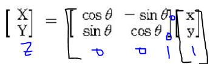

# 이미지 프로세싱

## 이미지 다루기

### 이미지 읽기

```python
cv2.imread('lena.jpg', cv2.IMREAD_COLOR)
```

- `cv2.IMREAD_COLOR` : 이미지 파일을 Color로 읽어들입니다. 투명한 부분은 무시됩니다. Default
- `cv2.IMREAD_GRAYSCALE` : 이미지를 Grayscale로 읽어 들입니다. 실제 이미지 처리시 중간단계로 많이 사용합니다.
- `cv2.IMREAD_UNCHANGED` : 이미지파일을 alpha channel까지 포함하여 읽어 들입니다.

참고) 3개의 flag대신에 1, 0, -1을 사용해도 됩니다.
위의 값은 numpy의 ndarray type입니다. numpy는 python에서 수학적 처리를 위한 모듈로 openCV에서도 많이 사용됩니다.

### 이미지 보기

```python
cv2.imshow('title', imgarray)
cv2.waitKey(0)
cv2.destroyAllWindows()
```

`cv2.waitKey()` 는 keyboard입력을 대기하는 함수로 0이면 key입력까지 무한대기이며 특정 시간동안 대기하려면 milisecond값을 넣어주면 됩니다.

`cv2.destroyAllWindows()` 는 화면에 나타난 윈도우를 종료합니다. 일반적으로 위 3개는 같이 사용됩니다.

* Matplotlib 사용

```python
from matplotlib import pyplot as plt
cv2.imread('lena.jpg', cv2.IMREAD_COLOR)
plt.imshow(img)
plt.xticks([]) # x축 눈금
plt.yticks([]) # y축 눈금
plt.show()
```

### 이미지 저장

```python
cv2.imwrite('filename.png', imgarray)
```

### BGR to RGB

```python
import cv2
from matplotlib import pyplot as plt

img = cv2.imread('lena.jpg', cv2.IMREAD_COLOR)

b, g, r = cv2.split(img)
img2 = cv2.merge([r,g,b])

plt.imshow(img2)
plt.show()
```

## 영상 다루기


```python

```


```python

```


```python

```


```python

```

## 도형 그리기


```python
# Line 그리기
cv2.line(img, start, end, color, thickness)
cv2.line(img, (0, 0), (511, 511), (255, 0, 0), 5)

# 사각형 그리기
cv2.rectangle(img, start, end, color, thickness)
cv2.rectangle(img, (384, 0), (510, 128), (0,255,0), 3)

# 원 그리기
cv2.circle(img, center, radian, color, thickness)
img = cv2.circle(img, (447,63), 63, (0,0,255), -1)

# 타원 그리기
cv2.ellipse(img, center, axes, angle, startAngle, endAngle, color[, thickness[, lineType[, shift]]])
cv2.ellipse(img, (256,256), (100,50), 0, 0, 180, 255, -1)

# polygon 그리기
cv2.polylines(img, pts, isClosed, color, thickness)
pts = np.array([[10,5], [20,30], [70,20], [50,10]], np.int32) # 각 꼭지점은 2차원 행렬로 선언
# 이미지에 표현하기 위해 3차원 행렬로 변환. 변환이전과 이후의 행렬 갯수는 동일해야함.
# -1은 원본에 해당하는 값을 그대로 유지.
pts = pts.reshape((-1, 1, 2))
img = cv2.polylines(img, [pts], True, (0,255,255))
```

* 이미지에 Text 추가


```python
cv2.putText(img, text, org, font, fontSacle, color)
cv2.putText(img, 'OpenCV', (10,500), cv2.FONT_HERSHEY_SIMPLEX, 4, (255,255,255), 2)
```

## Mouse로 그리기


```python

```


```python

```

## Trackbar

```python

```


```python

```

## Basic Operation

ㅇ

```python

```


```python

```


## 이미지 연산


```python

```


```python

```

## 이미지 Processing

Binary Image는 pixel당 1bit로 표현하는 영상을 의미합니다. 즉 흰색과 검은색으로만 표현이 되는 영상입니다.

Grayscale Image는 Pixel당 8bit, 즉 256단계의 명암(빛의 세기)을 표현할 수 있는 이미지입니다.

Color 이미지는 pixel의 색을 표현하기 위해서 pixel당 24bit를 사용합니다. 총 16,777,216 가지의 색을 표현할 수 있습니다. 이것을 일반적으로 True color image라고 합니다. pixel은 RGB 각각을 위해서 8bit를 사용하게 됩니다.


HSV의 의미는 다음과 같습니다.

- H(ue) : 색상. 일반적인 색을 의미함. 원추모형에서 각도로 표현이 됨.(0: Red, 120도 : Green, 240: Blue)
- S(aturation) : 채도. 색읜 순수성을 의미하며 일반적으로 짙다, 흐리다로 표현이 됨. 중심에서 바깥쪽으로 이동하면 채도가 높음.
- V(alue) : 명도. 색의 밝고 어두운 정도. 수직축의 깊이로 표현. 어둡다 밝다로 표현이 됨.

### Color-space 변환

```python
cv2.cvtColor(imgarray, cv2.COLOR_BGR2RGB)
cv2.cvtColor(imgarray, cv2.COLOR_BGR2GRAY)
cv2.cvtColor(imgarray, cv2.COLOR_BGR2HSV)
```

참고) Hue는 [0,179], Saturation은 [0,255], Value는 [0,255]로 표현이 됩니다.

### inRange


```python
lower_blue = np.array([110, 50, 50])
upper_blue = np.array([130, 255, 255])
mask = cv2.inRange(hsv, lower, upper)
```

# 이미지 임계처리 (Thresholding)

## 기본 임계처리

```python
cv2.threshold(src, thresh, maxval, type) → retval, dst
_, thresh1 = cv2.threshold(img,127,255, cv2.THRESH_BINARY)
```

- **src** – input image로 single-channel 이미지.(grayscale 이미지)
- **thresh** – 임계값
- **maxval** – 임계값을 넘었을 때 적용할 value
- **type** – thresholding type
  - cv2.THRESH_BINARY
  - cv2.THRESH_BINARY_INV
  - cv2.THRESH_TRUNC
  - cv2.THRESH_TOZERO
  - cv2.THRESH_TOZERO_INV

* (참고) 여러 이미지를 하나의 화면에 보여줄때 `plt.subplot()` 함수를 사용합니다.


```python
for i in xrange(6):
    plt.subplot(2,3,i+1),plt.imshow(images[i],'gray')
```

## 적응 임계처리

이전에는 임계값을 이미지 전체에 적용하여 처리하기 때문에 하나의 이미지에 음영이 다르면 일부 영역이 모두 흰색 또는 검정색으로 보여지게 됩니다.

이런 문제를 해결하기 위해서 이미지의 작은 영역별로 thresholding을 하는 것입니다. 이때 사용하는 함수가 `cv2.adaptiveThreshold()` 입니다.

```python
cv2.adaptiveThreshold(src, maxValue, adaptiveMethod, thresholdType, blockSize, C)
```

- **src** – grayscale image
- **maxValue** – 임계값
- **adaptiveMethod** – thresholding value를 결정하는 계산 방법
  - cv2.ADAPTIVE_THRESH_MEAN_C : X, Y를 중심으로 block Size * block Size 안에 있는 픽셀 값의 평균에서 C를 뺸 값을 문턱값으로 함
  - cv2.ADAPTIVE_THRESH_GAUSSIAN_C : X, Y를 중심으로 block Size * block Size 안에 있는 Gaussian 윈도우 기반 가중치들의 합에서 C를 뺀 값을 문턱값으로 한다.
- **thresholdType** – threshold type
- **blockSize** – thresholding을 적용할 영역 사이즈
- **C** – 평균이나 가중평균에서 차감할 값

## Otsu의 이진화

임계값을 어떻게 정의해야 할까요? 가장 일반적인 방법은 trial and error방식으로 결정했습니다. 그러나 **bimodal image** (히스토그램으로 분석하면 2개의 peak가 있는 이미지)의 경우는 히스토그램에서 임계값을 어느정도 정확히 계산 할 수 있습니다. Otsu의 이진화(Otsu’s Binarization)란 bimodal image에서 임계값을 자동으로 계산해주는 것을 말합니다.

적용 방법은 `cv2.threshold()` 함수의 flag에 추가로 `cv2.THRESH_STSU` 를 적용하면 됩니다. 이때 임계값은 0으로 전달하면 됩니다.


```python
_, th2 = cv2.threshold(img, 0, 255, cv2.THRESH_BINARY+cv2.THRESH_OTSU)
```


# Image Smoothing

## Image Filtering

고주파를 제거하면 Blur처리가 되며, 저주파를 제거하면 대상의 영역을 확인할 수 있습니다.

Low-pass filter(LPF)와 High-pass filter(HPF)를 이용하여, LPF를 적용하면 노이즈제거나 blur처리를 할 수 있으며, HPF를 적용하면 경계선을 찾을 수 있습니다.

OpenCV에서는 `cv2.filter2D()` 함수를 이용하여 이미지에 kernel(filter)를 적용하여 이미지를 Filtering할 수 있습니다. kernel은 행렬을 의미하는데 kernel의 크기가 크면 이미지 전체가 blur처리가 많이 됩니다.

Filter가 적용되는 방법은

> - 이미지의 각 pixel에 kernel을 적용합니다.
> - 위 kernel을 예로들면 각 pixel에 5X5윈도우를 올려 놓고, 그 영역안에 포함되는 값의 Sum을 한 후에 25로 나눕니다.
> - 그 결과는 해당 윈도우 영역안의 평균값이 되고, 그 값을 해당 pixel에 적용하는 방식입니다.


## Image Blurring

### Averaging

`cv2.blur()` 또는 `cv2.boxFilter()` 함수로 적용할 수 있습니다.

```python
cv2.blur(src, ksize)
```

### Gaussian Filtering

kernel의 사이즈는 양수이면서 홀수로 지정을 해야 합니다. 이미지의 Gaussian Noise (전체적으로 밀도가 동일한 노이즈, 백색노이즈)를 제거하는 데 가장 효과적입니다.


```python
cv2.GaussianBlur(img, ksize, sigmaX)
```

- **img** – Chennel수는 상관없으나, depth(Data Type)은 CV_8U, CV_16U, CV_16S, CV_32F or CV_64F.
- **ksize** – (width, height) 형태의 kernel size. width와 height는 서로 다를 수 있지만, 양수의 홀수로 지정해야 함.
- **sigmaX** – Gaussian kernel standard deviation in X direction.

### Median Filtering

중간값을 선택하여 적용합니다. [salt-and-pepper noise](https://ko.wikipedia.org/wiki/점잡음) 제거에 가장 효과적입니다.

```python
cv2.medianBlur(src, ksize)
```

### Bilateral Filtering

Bilateral Filtering(양방향 필터)은 경계선을 유지하면서 Gaussian Blur처리를 해주는 방법입니다.

Gaussian 필터를 적용하고, 또 하나의 Gaussian 필터를 주변 pixel까지 고려하여 적용하는 방식입니다.

Gaussian 필터를 이용하지만 픽셀의 intensity 차이를 고려한 또 하나의 Gaussian 필터를 적용합니다. -> edge가 보존


```python
cv2.bilateralFilter(src, d, sigmaColor, sigmaSpace)
```

- **src** – 8-bit, 1 or 3 Channel image
- **d** – filtering시 고려할 주변 pixel 지름
- **sigmaColor** – Color를 고려할 공간. 숫자가 크면 멀리 있는 색도 고려함.
- **sigmaSpace** – 숫자가 크면 멀리 있는 pixel도 고려함.


* 예제

```python
dst1 = cv2.blur(img,(7,7))
dst2 = cv2.GaussianBlur(img,(5,5),0)
dst3 = cv2.medianBlur(img,9)
dst4 = cv2.bilateralFilter(img,9,75,75)
```

# Image Gradients


# Image Pyramids


# Image Contours

Contours란 동일한 색 또는 동일한 강도를 가지고 있는 영역의 경계선을 연결한 선입니다.

주의! OpenCV에서 Contour 찾기는 검정색 배경에서 흰색 물체를 찾는 것.

- 정확도를 높히기 위해서 Binary Image를 사용합니다. threshold나 canny edge를 선처리로 수행합니다.
- `cv2.findContours()` 함수는 원본 이미지를 직접 수정하기 때문에, 원본 이미지를 보존 하려면 Copy해서 사용해야 합니다.
- OpenCV에서는 contours를 찾는 것은 검은색 배경에서 하얀색 대상을 찾는 것과 비슷합니다. 그래서 대상은 흰색, 배경은 검은색으로 해야 합니다.

``` python
cv2.findContours(image, mode, method[, contours[, hierarchy[, offset]]])
```

- image – 8-bit single-channel image. binary image.

- mode - contours를 찾는 방법

  - `cv2.RETR_EXTERNAL` : contours line중 가장 바같쪽 Line만 찾음.
- `cv2.RETR_LIST` : 모든 contours line을 찾지만, hierachy 관계를 구성하지 않음.
  - `cv2.RETR_CCOMP` : 모든 contours line을 찾으며, hieracy관계는 2-level로 구성함.
- `cv2.RETR_TREE` : 모든 contours line을 찾으며, 모든 hieracy관계를 구성함.
  
- method – contours를 찾을 때 사용하는 근사치 방법

  - `cv2.CHAIN_APPROX_NONE` : 모든 contours point를 저장.
- `cv2.CHAIN_APPROX_SIMPLE` : contours line을 그릴 수 있는 point 만 저장. (ex; 사각형이면 4개 point)
  - `cv2.CHAIN_APPROX_TC89_L1` : contours point를 찾는 algorithm
- `cv2.CHAIN_APPROX_TC89_KCOS` : contours point를 찾는 algorithm

* Returns : image, contours , hierachy

```python
cv2.drawContours(image, contours, contourIdx, color[, thickness[, lineType[, hierarchy[, maxLevel[, offset]]]]])
```

- image – 원본 이미지
- contours – contours정보. list로 들어가야 해
- contourIdx – contours list type에서 몇번째 contours line을 그릴 것인지. -1 이면 전체
- color – contours line color
- thickness – contours line의 두께. 음수이면 contours line의 내부를 채움.

# Contour Feature

* Image Moment는 대상을 구분할 수 있는 특징을 의미합니다.. 특징으로는 Area, Perimeter, 중심점 등이 있습니다. Image Moments는 대상을 구분한 후, 다른 대상과 구분하기 위해 대상을 설명(describe)하는 자료로 사용됩니다.
* Contour면적은 moments의 `m00` 값이거나 `cv2.contourArea()` 함수로 구할 수 있다.

### Contour Perimeter

Contour의 둘레 길이를 구할 수 있습니다. 사각형의 경우는 둘레길이의 합이 됩니다. 아래 함수의 2번째 argument가 true이면 폐곡선 도형을 만들어 둘레길이를 구하고, False이면 시작점과 끝점을 연결하지 않고 둘레 길이를 구합니다.

```python
>>> cv2.arcLength(cnt, True)
750.0
>>> cv2.arcLength(cnt, False)
494.0
```

### Contour Approximation

`cv2.findContours()` 함수에 의해서 찾은 contours line은 각각의 contours point를 가지고 있습니다. 이 Point를 연결하여 Line을 그리게 됩니다. 이때 이 point의 수를 줄여 근사한 line을 그릴 때 사용되는 방법입니다.

Point의 수를 줄이는데 사용되는 방식은 [Douglas-Peucker algorithm](https://en.wikipedia.org/wiki/Ramer-Douglas-Peucker_algorithm) 입니다.

근사치를 찾는데 사용되는 함수는 `cv2.approxPolyDP()` 입니다.

```python
cv2.approxPolyDP(curve, epsilon, closed[, approxCurve])
```

- **curve** – contours point array
- **epsilon** – original cuve와 근사치의 최대거리. 최대거리가 클 수록 더 먼 곳의 Point까지 고려하기 때문에 Point수가 줄어듬.
- **closed** – 폐곡선 여부

### Convex Hull

Convex Hull이란 contours point를 모두 포함하는 볼록한 외관선을 의미합니다. Contour Approximation과 유사한 결과지만, 방법은 전혀 다릅니다.

```python
cv2.convexHull(array)
```

### Checking Convexity

`cv2.isContourConvex()` 함수는 contour가 convex인지 아닌지 판단하여 True 또는 False를 Return합니다. 여기서 convex란 contour line이 볼록하거나 최소한 평평한 것을 의미합니다.(오목한 부분이 없는 것입니다.)

위 예제에는 2개의 contour가 있는데, 첫번째는 이미지의 전체 외곽선(사각형)이고 두번째는 손 모양의 contour line입니다. 그래서 결과는 아래와 같습니다.

```
>>> cv2.isContourConvex(contours[0]) # 외곽선 contour line
True
>>> cv2.isContourConvex(contours[1]) # 손 모양 contour line
False
```


### Bounding Rectangle

Contours Line을 둘러싸는 사각형을 그리는 방법입니다. 사각형을 그리는 방법은 2가지가 있습니다.

1. **Straight Bounding Rectangle** : 대상의 Rotation은 무시한 사각형 모양입니다.

```
x,y,w,h = cv2.boundingRect(cnt)
img = cv2.rectangle(img,(x,y),(x+w,y+h),(0,255,0),2)
```

1. **Rotated Rectangle** : 대상을 모두 포함하면서, 최소한의 영역을 차지하는 사각형 모양입니다.

```
rect = cv2.minAreaRect(cnt)
box = cv2.boxPoints(rect)
box = np.int0(box)
im = cv2.drawContours(im,[box],0,(0,0,255),2)
```

### Minumum Enclosing Circle

Contours line을 완전히 포함하는 원 중 가장 작은 원을 그릴 수 있습니다.

```
(x,y),radius = cv2.minEnclosingCircle(cnt)
center = (int(x),int(y))
radius = int(radius)
img = cv2.circle(img,center,radius,(0,255,0),2)
```

### Fitting an Ellipse

Contours Line을 둘러싸는 타원을 그릴 수 있습니다.

```
ellipse = cv2.fitEllipse(cnt)
im = cv2.ellipse(im,ellipse,(0,255,0),2)
```

# Contour Property


# Morphological Transformations

영상을 형태학적 관점에서 보고 접근하는 방법

영상내에 존재하는 특정 객체의 형태를 변형시키는 용도로 사용되는 영상처리기법

* 이진영상처리에 주로 사용됨

* 집합의 포함관계,이동,대칭,여집합,차집합 등을 이용함

* 영상에서 잡음을 제거하거나 ,영상에서 객체의 모양을 기술하는 용도로 사용됨
  예: 모폴로지의 대표적인 예로 침식과 팽창연산이있음
* 고수준 모폴로지 를 적용하려면 morphologyEx 함수를 이용

## Erode, Dilate

필터 내부의 가장 낮은(어두운) 값으로 변환(and) - 침식연산

* 바이너리 이미지에서 흰색 오브젝트의 외곽 픽셀을 0(검은색)으로 만듭니다. 
* Foreground 가 되는 이미지의 경계부분을 침식시켜서 Background 이미지로 전환한다.
* Foreground 이미지가 가늘게 된다.
* 흐릿한 경계부분은 배경으로 만들어버린다고 생각

```python
cv2.erode(src, kernel, dst, anchor, iterations, borderType, borderValue)
erosion = cv2.erode(img, kernel, iterations=1)
```

- **src** – the depth should be one of CV_8U, CV_16U, CV_16S, CV_32F or CV_64F.
- **kernel** – structuring element. `cv2.getStructuringElemet()` 함수로 만들 수 있음.
- **anchor** – structuring element의 중심. default (-1,-1)로 중심점.
- **iterations** – erosion 적용 반복 횟수

필터 크기를 크게 할 수록 변화량이 많아진다.

사용한 커널의 크기에 따라  오브젝트 외곽에서 0이 되는 픽셀의 정도가 달라집니다. 

iterations : 반복 수행 횟수

3번째 인자는 mask의 중심점인데 default로 -1,-1이 들어간다. 

## Dilate

필터 내부의 가장 높은(밝은) 값으로 변환(or) - 팽창연산

```python
cv2.dilation(src, kernel, dst, anchor, iterations, borderType, borderValue)
```

- **rc** – the depth should be one of CV_8U, CV_16U, CV_16S, CV_32F or CV_64F.
- **kernel** – structuring element. `cv2.getStructuringElemet()` 함수로 만들 수 있음.
- **anchor** – structuring element의 중심. default (-1,-1)로 중심점.
- **iterations** – dilation 적용 반복 횟수

* 바이너
* 리 이미지에서 흰색 오브젝트의 외곽 픽셀 주변에 1(흰색)으로 추가합니다. 
* 노이즈(작은 흰색 오브젝트)를 없애기 위해 사용한 Erosion에 의해서 작아졌던 오브젝트를 원래대로 돌리거나 인접해 있는 오브젝트들을 하나로 만드는데 사용할 수 있습니다. 

## Opening

두 연산은 순서에 따라 서로 다른 기능을 한다. 

* Erode - Dilate
*  `cv2.MORPH_OPEN`

* 이미지 상의 노이즈(작은 흰색 물체)를 제거하는데 사용합니다. 

```python
kernel = np.ones((5, 5), np.uint8)
result = cv2.morphologyEx(img, cv2.MORPH_OPEN, kernel)
```

```python
cv2.morphologyEx(src, op, kernel[, dst[, anchor[, iterations[, borderType[, borderValue]]]]])

opened = cv2.cv2.morphologyEx(binary, cv2.MORPH_OPEN,
            cv2.getStructuringElement(cv2.MORPH_ELLIPSE, (5,5)), iterations=5)
```

- **src** – Source image. The number of channels can be arbitrary. The depth should be one of `CV_8U`, `CV_16U`, `CV_16S`, `CV_32F` or ``CV_64F`.
- op - Type of a morphological operation that can be one of the following:
  - **MORPH_OPEN** - an opening operation
  - **MORPH_CLOSE** - a closing operation
  - **MORPH_GRADIENT** - a morphological gradient. Dilation과 erosion의 차이.
  - **MORPH_TOPHAT** - “top hat”. Opeining과 원본 이미지의 차이
  - **MORPH_BLACKHAT** - “black hat”. Closing과 원본 이미지의 차이
- **kernel** – structuring element. `cv2.getStructuringElemet()` 함수로 만들 수 있음.
- **anchor** – structuring element의 중심. default (-1,-1)로 중심점.
- **iterations** – erosion and dilation 적용 횟수
- **borderType** – Pixel extrapolation method. See `borderInterpolate` for details.
- **borderValue** – Border value in case of a constant border. The default value has a special meaning.

## Closing

* Dilate - Erode
* `cv2.MORPH_CLOSE`

* 보통 한 객체를 추출했을 때 두개 이상의 작은 부분으로 나올 경우 큰 객체로 합칠 때 사용한다. 
* 희색 오브젝트에 있는 작은 검은색 구멍들을 메우는데 사용합니다.

```python
closed = cv2.cv2.morphologyEx(binary, cv2.MORPH_CLOSE,
            cv2.getStructuringElement(cv2.MORPH_ELLIPSE, (5,5)), iterations=5)
```


(200110)

# OCR 이미지 문자열 추출 (Tesseract)

* 로우레벨비전 ing.
  엣지 찾는게 아니라
  텍스트 찾기

* 광학인식=OCR 라이브러리가 있다.
  tesseract=마블에 나오는 하이퍼큐브 같은거
  인쇄체에 대해서는 잘 돼.
  거의 다 이 테서랙트 사용함

* 전처리를 잘 해야. binarization

* 영어 인식률은 99%.
  한글보다 한자 인식률이 더 높아.

## 가장자리 검출 (Edge Detection)

1단계 : 노이즈 제거

2단계 : gradient 값이 높은 부분 찾기

3단계 : 최댓값이 아닌 픽셀의 값을 0으로 만들기

4단계 : Hyteresis Thresholding : 실제 엣지인지 아닌지 판단. maxValue, minValue


### Canny

```python
cv2.Canny(원본 이미지, 임계값1, 임계값2, 커널 크기, L2그라디언트)
canny = cv2.Canny(src, 100, 255)
```

임계값 : 엣지의 크기

`임계값1`은 임계값1 `이하`에 포함된 가장자리는 가장자리에서 `제외`합니다.

`임계값2`는 임계값2 `이상`에 포함된 가장자리는 가장자리로 `간주`합니다.

`커널 크기`는 `Sobel` 마스크의 `Aperture Size`를 의미합니다. 포함하지 않을 경우, 자동으로 할당됩니다.

`L2그라디언트`는 `L2`방식의 사용 유/무를 설정합니다. 사용하지 않을 경우, 자동적으로 `L1그라디언트` 방식을 사용합니다.


일관적으로 밝아지고 있는지의 정도도 고려함. 연결되어있지 않는 엣지는 제외

-> 노이즈에 덜 민감. 지저분한 노이즈 안 나와.

### Sobel

```python
cv2.Sobel(그레이스케일 이미지, 정밀도, x방향 미분, y방향 미분, 커널, 배율, 델타, 픽셀 외삽법)
sobel = cv2.Sobel(gray, cv2.CV_8U, 1, 0, 3)
```

`정밀도`는 결과 이미지의 `이미지 정밀도`를 의미합니다. **정밀도에 따라 결과물이 달라질 수 있습니다.**

`x 방향 미분`은 이미지에서 `x 방향`으로 미분할 값을 설정합니다.

`y 방향 미분`은 이미지에서 `y 방향`으로 미분할 값을 설정합니다.

`커널`은 소벨 커널의 크기를 설정합니다. `1`, `3`, `5`, `7`의 값을 사용합니다.

`배율`은 계산된 미분 값에 대한 `배율값`입니다.

`델타`는 계산전 미분 값에 대한 `추가값`입니다.

`픽셀 외삽법`은 이미지를 가장자리 처리할 경우, 영역 밖의 픽셀은 `추정`해서 값을 할당해야합니다.

이미지 밖의 픽셀을 외삽하는데 사용되는 **테두리 모드**입니다. `외삽 방식`을 설정합니다.

- Tip : `x방향 미분 값`과 `y방향의 미분 값`의 합이 1 이상이여야 하며 각각의 값은 `0`보다 커야합니다.

### Laplacian

```python
cv2.Laplacian(그레이스케일 이미지, 정밀도, 커널, 배율, 델타, 픽셀 외삽법)
laplacian = cv2.Laplacian(gray, cv2.CV_8U, ksize=3)
```

`cv2.Laplacian(그레이스케일 이미지, 정밀도, 커널, 배율, 델타, 픽셀 외삽법)`를 이용하여 **가장자리 검출을 적용합니다.**

`정밀도`는 결과 이미지의 `이미지 정밀도`를 의미합니다. **정밀도에 따라 결과물이 달라질 수 있습니다.**

`커널`은 **2차 미분 필터의 크기**를 설정합니다. `1`, `3`, `5`, `7`의 값을 사용합니다.

`배율`은 계산된 미분 값에 대한 `배율값`입니다.

`델타`는 계산전 미분 값에 대한 `추가값`입니다.

`픽셀 외삽법`은 이미지를 가장자리 처리할 경우, 영역 밖의 픽셀은 `추정`해서 값을 할당해야합니다.

이미지 밖의 픽셀을 외삽하는데 사용되는 **테두리 모드**입니다. `외삽 방식`을 설정합니다.

- Tip : `커널`의 값이 1일 경우, `3x3 Aperture Size`를 사용합니다. **(중심값 = -4)**

# 이미지의 기하학적 변형

OpenCV : 전문가 / PIL은 일반인 대상으로 간편

## Affine Transformations

- 강체변환(Ridid-Body) : 크기 및 각도가 보존(ex; Translation, Rotation)
- 유사변환(Similarity) : 크기는 변하고 각도는 보존(ex; Scaling)
- 선형변환(Linear) : Vector 공간에서의 이동. 이동변환은 제외.
- Affine : 선형변환과 이동변환까지 포함. 선의 수평성은 유지.(ex;사각형->평행사변형)
- Perspective : Affine변환에 수평성도 유지되지 않음. 원근변환

## Scaling

```python
cv2.resize(img, dsize, fx, fy, interpolation)
img2 = cv2.resize(img, None, fx=0.5, fy=1, interpolation=cv2.INTER_AREA)
```

- **img**: 리사이징을 할 이미지 원본

- **None**: dsize를 나타내는 튜플 값으로 (가로방향 픽셀수, 세로방향 픽셀수)로 나타냅니다. 우리의 예제는 None으로 설정

- **fx, fy**: 각각 가로 방향, 세로 방향으로 배율 인자. 0.5로 지정하면 원래 크기의 0.5로 리사이징 하라는 의미임

- **interplolation**: 리사이징을 수행할 때 적용할 interpolation 방법

- - **INTER_NEAREST**: nearest-neighbor interpolation
  - **INTER_LINEAR**: bilinear interpolation (디폴트 값)
  - **INTER_AREA**: 픽셀 영역 관계를 이용한 resampling 방법으로 이미지 축소에 있어 선호되는 방법. 이미지를 확대하는 경우에는 INTER_NEAREST와 비슷한 효과를 보임
  - **INTER_CUBIC**: 4x4 픽셀에 적용되는 bicubic interpolation
  - **INTER_LANCZOS4** : 8x8 픽셀에 적용되는 Lanczos interpolation

interpolation을 할 때 리사이징에 따라 다른 방법을 적용하는 것이 좋습니다.

일반적으로 이미지를 축소하는 경우에는 cv2.INTER_AREA, 이미지를 확대하는 경우에는

cv2.INTER_CUBIC+cv2.INTER_LINEAR를 사용합니다.

## Translation

```python
cv2.warpAffine(src, M, dsize)

M = np.float32([
    [1, 0, 100], 
    [0, 1, 50]])
img2 = cv2.warpAffine(img, M, (w, h))
```

- **img**: 변환할 소스 이미지
- **M**: 2 x 3 변환 매트릭스. 1,0,0,1은 고정
- **(w, h)**: 출력될 이미지 사이즈 (tuple)

## Rotation

```python
cv2.getRotationMatrix2D(center, angle, scale)

#원본이미지 무게중심을 회전 중심으로 하고 45도 회전
h, w = img.shape[:2]
M = cv2.getRotationMatrix2D((w/2, h/2), 45, 1)
img2 = cv2.warpAffine(img, M, (w,h))
```




## Perspective Transform

affine 변환만으로는 부족


변환되기 전 3개의 좌표와 변환된 후 3개의 좌표를 알면 변환 매트릭스 M을 구할 수 있고, 이 M을 `cv2.warpAffine()` 함수에 적용하면 됩니다.

* Affine Transform
  최소 3개의 점

```python
h, w = img.shape[:2]
pts1 = np.float32(  [50,50], [200,50], [20,200]  )
pts2 = np.float32(  [10,100], [200,50], [100,250]  )
M = cv2.getPerspectiveTransform(pts1, pats2)
img2 = cv2.warpPerspective(img, M, (w, h))
```

* Perspective Transform
  4개의 점 (사각형)

```python
h, w = img.shape[:2]
pts1 = np.float32(  [0,0], [300,0], [0,300], [300,300])
pts2 = np.float32(  [56,56], [368,52], [28,387], [389,390])
M = cv2.getPerspectiveTransform(pts1, pats2)
img2 = cv2.warpPerspective(img, M, (w, h))
```

```python
# 변환되기 전 4개 좌표와 변환된 후 4개 좌표를 통해 변환 매트릭스를 구합니다.
M = cv2.getPerspectiveTransform(pts1, pts2)
```


# REVIEW

영상

1. 색/이미지

주사율[fps]

sampling

정밀도 오류 / 시간차 오류

RGB (빛) - HSV(인간의 지각) - YCr.. (TV)

2. 산술연산

디자이너가 커브드곡선 설계 - 3DLUT[Look Up Table]

3. 필터 - 엣지     = CNN

4. 필터 - 이진화

정보를 단순화함, 알고리즘적으로 뭔가를 풀 수 있으니까

global / local binarization 

 -> Morphology - 침식, 팽창, 오픈, 클로즈

5. 기하학적 변형

r [  cos  -sin   dx   ]

   [  sin   cos   dy   ]

역방향 맵핑이 필요하므로.

# Corner

Low-Level Vision . 결과가 바로 안나오고 domain에 굉장히 민감.. 어떻게 처리하냐, 어떤 알고리즘을 적용하냐에 따라.

코너는 엣지보다 상위개념.

코너는 엣지가 교차되는 점이다.

QR코드 - 노이즈가 많이 껴도 코너점을 정확히 찾을 수 있다

* (참고)

자바 v.s. 자바스크립트

다른 언어. 

* 코너는 기본적으로 고주파 성분에 존재

코너⊃엣지

## Harris Corner Detection

해리스 코너 추출 함수 `cornerHarris`는 이미지 위에 커널을 이동시키면서 그레디언트의 변화량을 구하고 이 값을 적절한 기준값으로 구별하여 코너점을 찾는다.

```python
src = cv2.imread('../img/building.jpg')
gray = cv2.cvtColor(src, cv2.COLOR_BGR2GRAY)

#  block 크기, 소벨크기,         R=Det() - kTr()
harris = cv2.cornerHarris(gray, 3, 3, 0.04)  # R값 반환
harris_norm = cv2.normalize(harris, None, 0, 255, cv2.NORM_MINMAX, cv2.CV_8U)
#min~max 구간으로 scsaling하는 함수


dst = src.copy()

for y in range(harris_norm.shape[0]):              #행렬이니까 y먼저->x
        for x in range(harris_norm.shape[1]):
            if harris_norm[y, x] > 120:
                    cv2.circle(dst, (x, y), 5, (0, 0, 255), 2)  #원점,반지름,색,두께

imshow('gray', gray)
imshow('harris_norm', harris_norm)
print(harris_norm.dtype)  #uint8 : numpy type. (파이썬에는 uint8 없음)
imshow('dst', dst)
```

## FAST

FAST(Features from Accelerated Segment Test)도 코너를 찾는 알고리즘이다. 이름처럼 빠른 연산으로 유명하다.

Decision Tree를 이용해서 코너인가 아닌가를 판단한다.

1. 한 픽셀 p 를 중심으로하는 3픽셀의 반지름을 가지는 원을 만들고,
2. 그 원 위의 16개의 픽셀 값을 보고 코너를 찾는다.
3. p보다 기준값 이상 밝거나, 어두운 픽셀들이 n개 이상 연속적으로 존재하면 p를 Corner로 판단한다.

```python
src = cv2.imread('../img/chessboard.jpg', cv2.IMREAD_GRAYSCALE)

fast = cv2.FastFeatureDetector_create(50)
# 작아지면 코너 많이 검출됨, 원에서도 검출되지만 중첨되서 검출될수 있음. like threshold.
keypoints = fast.detect(src) #특징점

dst = cv2.cvtColor(src, cv2.COLOR_GRAY2BGR)

for kp in keypoints:
        pt = (int(kp.pt[0]), int(kp.pt[1]))
        cv2.circle(dst, pt, 5, (0, 0, 255), 2)

imshow('src', src)
imshow('dst', dst)
```


참고) ms계열 깔 땐 콘솔창 restart


QR Code가 OCR보다 성능이 훨씬 좋아

OCR 의 문제: 정확도를 확인할 수 없음

QR CODE는 디코딩만 하면 돼.

## 같은 픽셀 찾기

* 주변 픽셀도 같이 고려해야 함
* 코너점에 대해서만 할 거야
* 사진이 축소된다면? 정보가 사라져
  사진이 회전된다면? 정보가 달라져    -> Scale이 문제
  코너는 오로지 이동될 때만 가능

코너 1 byte = 512 or 256개의 byte(특징)으로 표시됨 (많다)

정보량이 풍부한 코너를 찾자 - 코너점 뿐만 아니라 대칭점까지 찾자

## SIFT

SIFT(Scale-Invariant Feature Transform)은 특징점의 크기와 각도까지 같이 계산하여 이미지의 크기가 변하거나 회전해도 동일한 특징점을 찾을 수 있도록 하는 방법이다.

또한 특징점 근처의 이미지 특성(히스토그램)도 같이 계산해서 특징점 이미지의 모양도 구별할 수 있도록 한다.

1. 먼저 **크기**에 불변한 특징점을 추출하기 위해서, 스케일 피라미드(Scale-Pyrimid)를 만든다. 스케일 피라미드란 이미지의 원본 이미지에서 2배, 1배, 1/2배, 1/4배 점차 줄인 이미지이다.
2. 이렇게 만든 스케일 피라미드의 각 이미지에서 특징점을 찾는다. 이렇게 찿은 특징점은 스케일 불변(Scale-Invariant)이다. 하지만 이미지의 회전에는 불변이 아니다.
3. 회전 불변 특성을 위해 특징점 주변의 그레디언트 방향과 크기를 수집한다. 특징점을 중심으로 윈도우를 설정하여 그 안의 픽셀에 대한 그레디언트의 크기와 방향을 구한다.
4. 360도를 36등분하여 36개의 bin을 가진 그레디언트 벡터 히스토그램을 만든다. 가장 값이 큰 bin이 해당 특징점의 방향, 그 bin의 크기가 특징점의 크기가 된다.

SIFT 굉장히 느려. ORB 무료.

SIFT 4.0되면서 유료, 사용 못 함.

## ORB

ORB(Oriented FAST and Rotated BRIEF)

* integer 값이라서 계산 빠름

SIFT에서 하나의 특징점에 대한 정보(설명자)는 128차원의 실수 벡터이다. 이는 꽤 많은 메모리를 사용하고, 어쩌면 실제로 특징점을 매칭할 때, 모두 필요하지 않을 수도 있다. 이러한 잠재적인 리소스 낭비를 방지하기 위해서 BRIEF는 설명자 벡터를 특징점의 픽셀값을 기준으로 0, 1, 이진 값으로 나타낸다. BRIEF는 실제로 이미지에 매칭 하는 기능을 제공하는 것이 아니라, 이미지를 매칭할 때 사용되는 메모리를 절약하기 위한 설명자 표현법이다.

1. 먼저, FAST로 특징점을 찾고,
2. Harris corner dectection에서 사용하는 코너에 대한 정량적인 값을 기준으로 가장 코너성이 큰 NN개의 코너를 선택한다.
3. SIFT에서 설명한 스케일 피라미드를 만들어 똑같이 특징점을 추출하고 여러 스케일에 대한 특징점을 찾는다.
4. 다음으로 찾아낸 코너의 방향을 알기 위해서, 한 윈도우 안에서 Intesity Centroid라는 것을 계산 한다. 특징으로 추출된(코너) 픽셀을 중심으로 윈도우를 형성하고, 중심에 있는 코너로 부터 계산한 Intesity Centroid의 방향이 코너의 방향성을 대변한다.
5. 설명자로 BRIEF를 사용하고자 했지만, BRIEF는 방향에 대한 정보를 가지지 않기 때문에, steer-BRIEF라는 것을 사용한다.
6. 또한, steer-BRIEF는 벡터의 분산값이 작기 때문에, 평균은 그대로 두고, 높은 분산값을 가지게 하는 과정을 거친다. 이렇게 많든 BRIEF를 rBRIEF 라고 한다.
7. 실제로 이미지를 매칭할 때는 multi-probe LSH(Locality Sensetive Hashing)를 사용한다.

### ORB 특징점 매칭

32bytes 데이터가 같은 점끼리 매칭