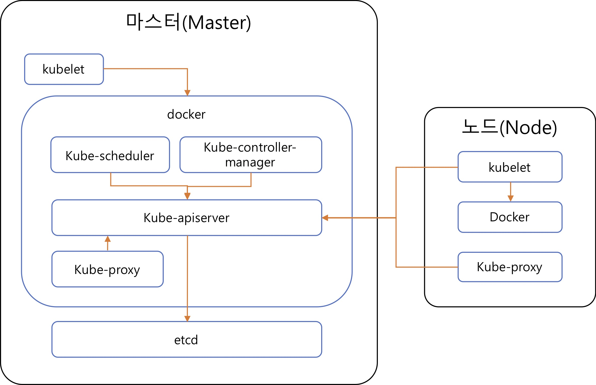

# Docker

* Machine Virtualization (2세대)

리소스 격리

cpu, memory 몇 개 쓸 건지 설정

VMware

os가 두 층

* Containers (3세대)

os가 한 층.

application level로

overhead가 없다

## Virtualization

go language: independence


* overlay file system

## Container

격리 -> 보안 유리

cloud 기술의 근본


---

자료구조, 운영체제, 파일구조

(알고리즘)

네트워크

---


# Chatbot

채널(플친) <-> 챗봇(open builder)


블록: 정적인 컨텐츠

스킬: (동적) 데이터를 받아 프로그램 돌림

학습

분석: 처리 안 된 문장들 공통점 발견해서 기존 문장에 넣는 과정 (수동적)


운영채널, 테스트채널 따로 있어.


k-load 는 POST 방식.


## 명함인식코드

Flask

RESTAPI "/namecard" 로 이미지 올리면

`save` /tmp/1.jpg

`인식` >python info.py   /tmp/

### 1. REST 서버

### 2. .py


### 1. flask 실행

cmd 창에서
cd 경로
set FLASK_APP main.py
flask run

### 2. POST방식 실습

```python
#main.py
from flask import Flask, escape, request

app = Flask(__name__)

# set FLASK_APP=파일명.py
# flask run

@app.route('/')
def hello():
    name = request.args.get("name","World")
    return f'Hello, {escape(name)}!'

@app.route('/hi', methods=['POST'])
def hi():
    return {
        "version" : "2.0",
        "templete" : {
            "outputs" : [
                {
                    "simpleText":{
                        "text" : "간단한 텍스트 요소입니다."
                    }
                }
            ]
        }
    }


if __name__ == "__main__":              
    app.run(host="127.0.0.1", port="5000")
```


```python
#test2.py
from flask import Flask, escape, request

app = Flask(__name__)

# set FLASK_APP=파일명.py
# flask run
db={}  #dictionary
id=0

@app.route('/users', methods=['POST'])
def create_user():
    #body = ...
    # todo body에 id를 넣어준다.
    global id
    body = request.json  #자료가 없으니 none 반환됨
    print(body)
    body['id'] = int(id)
    db[str(id)]=body['id']
    id+=1
    return body

@app.route('/users/{id}', methods=['GET'])
def select_user():
    return db[id]

def delete_user():
    pass

def update_user():
    pass

@app.route('/hi', methods=['POST'])
def hi():
    return {
        "version" : "2.0",
        "templete" : {
            "outputs" : [
                {
                    "simpleText":{
                        "text" : "간단한 텍스트 요소입니다."
                    }
                }
            ]
        }
    }


if __name__ == "__main__":              
    app.run(host="127.0.0.1", port="5000")
```


Postman 설치,실행

2XX : OK1

4XX : 클라이언트 오류 ex.404

5XX : 서버 오류


postman에서

http://127.0.0.1:5000/users 에서

Body-raw-JSON 으로 설정

```python
# 정보 추가해야 500 error 안나와
{
	"name":"name",
	"phone":"010"
}
```

Send

참고) 잼 걸리면 cmd에서 오른쪽마우스 클릭

### 3. select, delete, update

select는 `http://127.0.0.1:5000/users/1`에서 PUT 방식으로 JSON


* python의 pickle : 파이썬 객체 직렬화

(1분마다) 주기적으로 저장


# WEB

* GET / POST

get : url에 정보 담아, 길이제한 있음

post : body에 정보 담아, 길이제한 없음

(통신방식) 통신이 RESTAPI로 옮겨진 지 오래 됨

TCP~HTTP : 텍스트

RESTAPI : URL, body, method 이용해서 통신

method : get, post, put, delete, ...

CRUD[Creative,Retrieve,Update,Delete] : 필요

HTTP method와 일치.

리소스: url 경로로 표현 /a/b/c 계층.

표준


# ETC

이베이가 옥션 인수하고 지마켓 인수하려할 때

공정위가 조건하에 독과점 인정

조건: 3년간 수수료 인상 제한

쿠팡- 상장돼서.. AWS VIP. 


(200116)

연휴 다음날이 트래픽,매출이 가장 높아.

system에서의 탄력성: (후행성이지만) 트래픽 오를 때 같이 따라 올라가는 것.. 서버가 증설이 되어야겠지

지금까지.. 클라우드 나오기 전까지는 탄력성이 없었다

Super Dome (서버): 지마켓의 단일 서버.

C : 병행성 고려 안 한 언어.(cpu 2개) -> 구글에서 Go라는 언어 만듦

하드웨어 발전이 먼저, 소프트웨어 발전은 느림

MSSQL MS에서 직접 튜닝해줌.

컨설팅 유망

영업은 AI가 대체 불가 직군

입사후 2-3년 뒤 직군을 바꿀 수 있는 기회가 와: 기획자, 영업..


github 관리

tech. blog - 1. 트러블슈팅 2. tutorial 3. description

검색에서 1번을 많이 찾아

* global variable in flask

글로벌 변수로 쓰려면, 글로벌 변수를 쓰려는 곳에서 global 이라는 키워드로 선언을 해줘야 그 전역 변수를 불러다가 쓸 수 있다.

```python
id=0
db={}
ftn ..
	global id  #를 전역변수 선언해줘야 변수에 접근이 가능했다.
				#db는 선언 안 해도 오류 안 났음
```

으로 하거나

```python
from flask as g
g.id =0
g.db={}
```

flask 에서 g 를 제공해준다.

# 쿠버네티스

* 워크로드: 뭐든 실행할 수 있는

  데몬: 백그라운드에서 보이지 않게 작동하는 서비스. 본 서비스에 의존

  ​	java) thread: 일반/데몬스레드. 데몬은 메인스레드가 죽으면 죽어

* CI: 형상관리. git(소스)저장소. 원격으로 관리

  ​	목적 1. backup 2. history 3. conflict 관리

  ​	1인개발이면 필요없지만

  CD: 운영서비스에 투입,배치

  ​	netflix.


* GC(Garbage Collector) 기반 언어: JVM, C#, GO ...

  ​	서로 연결되어있는?

* Pod - deployment, daemonset, statefulset...

  stateless

* 가격비교 사이트: 에누리, 다나와, 네이버쇼핑

WEB / WAS 			// php는 합쳐져있다

php 서버 여러 개

fault tolerence (고가용성,내결함성) : 클라우드 시스템, 엔터프라이즈 시스템에서 중요


ILC = 인프라=코드 (장점)

ex) 알리익스프레스

* (네트웤) Ingress, Egress

Ingress는 외부로부터 서버 내부로 유입되는 네트워크 트래픽을, egress는 서버 내부에서 외부로 나가는 트래픽을 의미한다.

컴포넌트 정의. 서비스.

로드밸런서~~스위치 : 필요한 포트로만 신호 전달.

L4 switch(Transport Layer): TCP 프로토콜 레벨에서 트래픽 분기 가능

L7 switch(Application Layer): 


## 쿠버네티스 왜 필요한가?

운영환경에서의 컨테이너 관리

* 가동 중지 시간이 없는지 확인
* 다운되면 다른 컨테이너 다시 시작
* 분산 시스템을 탄력적으로 실행
* 애플리케이션의 확장과 장애 조치
* 배포 패턴 제공 (카나리아 배포)

e.g.) 카나리아가 유독가스에 민감해. 하나의 희생양으로 테스트

카나리아 테스트: 한 대만 최신용으로 바꿔봄(적용). 트래픽 골고루 분산되어 동일한 트래픽 받는데 문제없는지 확인.

하루정도 지나니 system prob는 없는데 logical prob 생김

-> 원복=rollback

## 기능

1. 서비스 디스커버리와 로드 밸런싱
2. 스토리지 오케스트레이션
   여러 노드에 분산된 스토리지를 하나로 묶어주는 역할
   쿠퍼네티스 자체가 도커 오케스트레이션 플랫폼.
   e.g. 각 서버마다 100기가씩 하드디스크이면 하나로 묶어 300기가

3. 자동화된 롤아웃과 롤백
4. 자동화된 빈 패킹(bin packing)
5. 자동화된 복구(self-healing)
6. 시크릿과 구성 관리


## 쿠버네티스는 PaaS가 아니다

* IaaS(Infrastructure as a Service) : EC2. 가상머신

* PaaS(Platform as a Service) : 번역API, 지도검색API, ... 기능단위로 제공. API제공하는 경우 많음. 하나의 부품으로 사용.

​			개발-테스트-배포-운영의 application cycle을 전반적으로 운영 (장점)

​			개발: 소스저장소 필요

​			테스트:테스트프레임워크 필요

​			배포: Jenkis... 배포관리서비스 필요

​			운영: 모니터링

등의 개발 PaaS가 쿠버네티스엔 없다.

-> PaaS 개발이 활발함

* SaaS(Software as a Service) : Dropbox, ... 앤드서비스. 파일 관련 서비스.

1. 지원하는 애플리케이션의 유형을 제약하지 않는다
2. 소스 코드를 배포하지 않으며 애플리케이션을 빌드하지 않는다.
3. 애플리케이션 레벨의 서비스를 제공하지 않는다.
4. 로깅, 모니터링 또는 경보 솔루션을 포함하지 않는다.
5. 포괄적인 머신 설정, 유지보수, 관리, 자동 복구 시스템을 제공하거나 채택하지 않는다.

## 아키텍처



https://arisu1000.tistory.com/27827?category=787056

마스터를 각각 설치 for 내결함성, (고가용성). 워커도 같이 설치

worker가 가장 중요. 모든 서비스를 받는 역할. 부하를 안 주기 위해서 M, E로 보내

Proxy: 대변자.

​			보통 생각하는 proxy process는 out-bound 개념

​			분기하는 기능을 reverse proxy라고 한다. 제품) HAproxy, Nginx

## Container

* Traditional Deployment

  * 리소스 한계 정의 불가능
  * 다른 애플리케이션 성능 저하

* Virtualized Deployment
  * VM 간에 애플리케이션 관리

  * 다른 쪽에 패킹 불가능 (보안성)

  * 리소스 효율적 활용

    OS가 두 개. 오버. 가상머신에서는 os가 달라도 됐어

* Container Deployment

  * 격리 속성을 완화

  * 애플리케이션 간 OS 공유

  * 자체 파일시스템, CPU, 메모리, 프로세스 공간 존재

  * 기존 인프라와의 종속성 없음 -> 어디에나 이식가능

  * 이미지 불변성 -> CI/CD에 적합.(바로 배포 가능) 빠르게 롤백가능

  * 개발시점에 이미지 생성하므로, 개발과 운영이 동일

    (이미지 단일 파일로 되어있으니 하나만 신경쓰면 됨.)

  * 자원격리. App 성능 예측 가능

    컨테이너 시대에서는 os가 같아야 해


## 파드

* 쿠버네티스 애플리케이션의 기본 시행단위

* 배포 단위

* 쿠버네티스의 애플리케이션 단일 인스턴스
  * 내부 컨테이너는 1개 (90% 이상)
  * 내부 컨테이너 2개 이상 (백그라운드 용도 프로세스)

* 수평적 스케일아웃
  * 인스턴스를 여러 개의 파드로 복제
* 파드를 직접적으로 사용 가능. 그러나 컨트롤러를 사용하여 파드를 관리하는 것이 쿠버네티스에서 훨씬 더 보편적.

JSON 과 YamL 서로 변환 가능.

## 서비스

ClusterIP

NodePort : 가장 많이 씀. 각 노드에 포트를 열어놓고 포트로 접속하면 알아서 접속해주는.

LoadBalancer

ExternalName

## ReplicaSet


## Deployment

roll-out, roll-back 역할 같이 함.

roll-out: 업데이트한 코드를 '적용'


(200117)

# CDN

Content Delivery Network

각 CDN 노드의 목적은 사이트의 정적 컨텐트 (이미지, CSS / JS 파일, 구성 요소)를 캐시하는 것. 전 세계에 걸쳐 CDN 서버 노드에 복사를 제공합니다. 따라서 사용자가 사이트를 요청하면 사용자에게 가장 가까운 노드가 데이터를 전송하여 대기 시간을 줄이고 사이트 로딩을 빠르게 제공 할 수 있습니다.

이와 같이 CDN은 캐시기능이 존재하는데 프록시와 유사합니다. 해외에서 요청이 들어왔을 때, CDN 노드에 기존에 방문한 기록이 있을 경우, 해당 노드에서 바로 처리하여 보여줍니다.

정적인 파일들(img, js, 동영상..) 다운 시간오래걸리니까 CDN 이용함.

캐싱, img resize 등 해줌

컨텐츠 위주 사이트: 트래픽 비용이 가장 많이 나가. 흔히 서버 비용이 많이 나간다고 생각하지만.


## CRUD (Create, Update, Delete)

대부분 서버 종류 라이브러리들은 호출/종료 함수 있음. flask에서 찾아서

```python
db = pickle.load
picke.save(db)
```

이렇게 하면 데이터베이스 만들어진다.

명함 두 개 올렸으면 캐로셀 형태로 10개까지 나올 수 있는..

## DB

mysql db 연동하는 것보다...

db: mysql, oracle... : 세부적인 컨트롤 가능한 장점 / 개발자 아니면 직접 볼 수 없다, 보려면 back-office(뒤에서 도와주는 웹사이트, 관리자페이지)를 따로 만들어서 보여줘야해

google docs의 ;spread sheet: db, back-office 한번에 해줄 수 있음

# Trouble Shooting

anaconda~ 파일은 버려

내 파일 line ## 봐

error log 봐


---

# Sourcetree

* github

merge request

pull request


git에는 없고 github에만 있는 기능: fork : 복제 저장소

github 서비스임. 서버 구축하지 않아도 돼. 추후 설치도 지원함

gitLab 설치형 이었는데 추후 서비스도 제공


* Sourcetree

github 뿐만 아니라 다른 저장소도 추가 가능


# 정적 호스팅

자바스크립트 속도가 빨라서 발전속도 빠름

JS 엔진

V8 -> 크롬엔진

HTML5까지 시너지

페이스북 페이지는 react로 만든 것. 기능이 많아

파트나눠서 개발할 수 있게 만든 것이 react -> moble native app 만듦

-> facebook app, instagram 이 이 framework으로 만들어져 있음


markdown format -> Jekyll (Ruby) HTML 변환 엔진을 통해