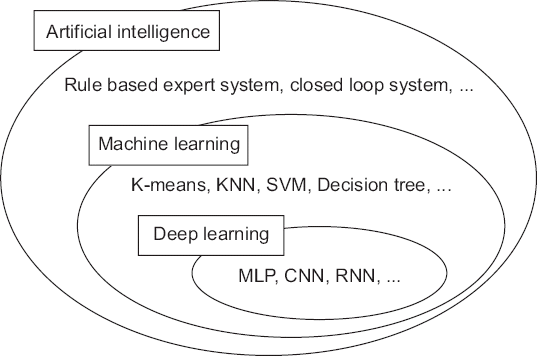
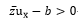
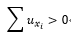
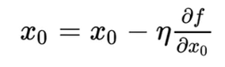
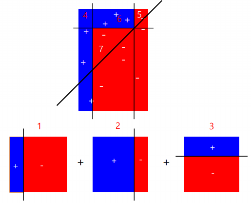
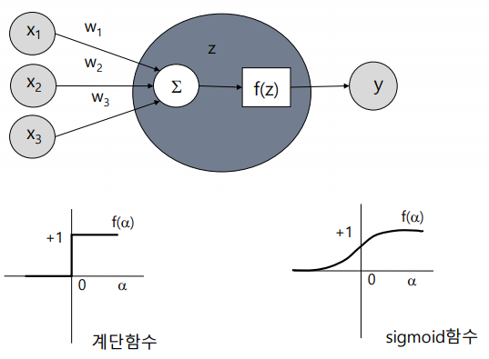
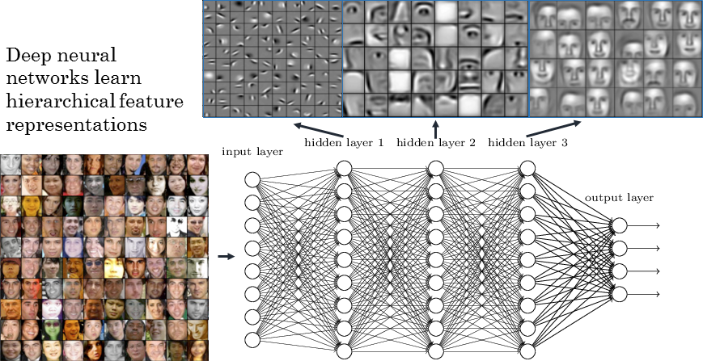

# DNN

## 커리큘럼

8일 동안 안내된 커리큘럼은 다음과 같은데

전이학습 (객체인식)

객체검출

CNN ReLU -----------> 먼저 할 게. Deep learing, CNN 복잡한 구조..

영상 감정 학습


다음 챗봇 (나중)


실습: Tensorflow or Kerras 중 Kerras로 할 거야. Tensorflow는  사소한 부분에서도 에러 많아서

실습환경? AWS 계정 공급될 거야


## 중간 체크

1. 기계학습과 딥러닝의 차이점은?

   

   AI ⊃ 기계학습 ⊃ 딥러닝.

   신경망 -> 가중치.

   기계학습 : 주어진 데이터를 이용하여 값을 예측하는 모델링을 만드는 것

   보통은 직선을 찾으려 함, 쉬우니까

   수학적으로는 직선 방정식 문제: MLS :다층구조 불가.

   어떻게 잘 분류할 것인가?

   - SVM(Support Vector Merchine): 직선을 찾는 건 맞는데.. 알고리즘: 경계값 마지노선 라인의 중간선을 구하는 것. 두 값만 사용
   - 신경망: y=ax+b 의 a,b를 구하는데 반복적인 최적화를 통해 최적화된 a,b 찾기(이 알고리즘=경사하강법)

2. 경사하강법 그림으로 표현하면?

   경사하강법: 다층 네트워크 가능. 직선이 아니라 신경망으로 봄.

   깊이가 깊은 네트웤=딥러닝.

3. 가중치는 (생물학적인) 신경망의 어디에 해당하는가?

   시냅스의 신경전달물질(NTM) 양 = Weight

   W만 복사하면 학습할 필요 없다. W를 학습하는 것.

   
   b: 신경망에서는 bias (기하학에서는 y절편)

   대소관계 따라 0 or 1.

4. 어떻게 다층으로 복잡한 문제를 풀 수 있는가?

   b를 없앤 수식은 이렇게 표현하기도
   

5. 다층 네트웍을 학습시키기가 어려운 이유는?

6. y=wx+b 에서 b는 왜 필요한가?

   직선 모델링 시 원점을 지나야 한다는 건 큰 제약조건.

   batch normalization하면 w에 덜 의존적, 성능 향상.

7. 활성화는 비선형이어야 하는가?

8. sigmoid 함수의 장점은?

9. 딥러닝의 핵심 돌파구는?

   왜 층이 깊어질수록 성능이 나빠지는가?

   층마다 학습된 것/안 된 것이 있는데. 뒷층으로 갈 수록 학습이 안 돼

   학습이 안 된 것 = random. weight가 처음은 randomly잖아->결과도 안 나와

   (코드상) 뒤에 있는 것은 학습이 잘 돼, 앞으로 갈 수록 학습이 안 돼.

   신경망 핵심 알고리즘: MLP에서 역전파 알고리즘이라서.

   ​	목적값(target value)이 맨 뒤에 있음.

   ​	그 앞의 target value가 없는 거야. 학습 어떻게 시켜?

   ​	다층 구조에서 학습하는 방법 개발 -> 역전파

   ​	깊어질 수록 위의 weight value는 잘 안 변해, random value니까

   ​	-> 예측할 때 위의 값이 랜덤벨류니까 결과가 나쁨

10. 왜 cnn은 특징추출과 분류기결합으로 보는가?


python을 python답게 쓰는 방법

if문을 안 쓰는 것 - vertor... matrix 이용 -> gpu 활용해서 계산 능력 향상

모든 문제를 행렬로 변환하는게 편해.

numpy : 다차원 배열. 장점1: 고속으로 계산 가능 (몇백배) 장점2: 단일 data type만 들어가


NVIDIA - GPU v.s. CPU (유투브)

GPU가 없었다면 지금의 딥러닝 시대는 못 왔을 것

CPU는 color도 어렵

GPU는 80ms만에  가능

GPU는 단순 산술 연산만 할 수 있는 것들이 여러 개 모여있는 것 -> 단순반복 시 유리


## XOR

### tensorflow 2.0.0 설치

```python
conda create -n envname
conda activate envname
conda tensorflow version==2.0.0
conda uninstall tensorflow
```


### SGD (Stochastic Gradient Descent)

경사하강법: 방향의 문제. not 길이. 미분의 반대 방향으로.

확률적~: 방향 결정이 확률적이다



n = learning rate (step size) : 기울기 반대 방향으로 얼만큼 x를 움직일지

batch size: 한번에 네트워크에 넘겨주는 데이터의 수

​					gpu는 메모리가 작아. 큰 데이터는 못 넣음 -> batch size를 작게 넣어줌 (v.s. cpu는 무한대 가상메모리 given)

epochs: 학습 수. 다시 실행시키면 현재 시점에서 다시 시작해

​				전체 데이터를 한번 다 돌아서 학습한 1 cycle = 1 epoch

​				반복시키면 현재 시점에서 시작함


google)

1. w1에 대한 시작점을 선택합니다.

2. 시작점에서 손실 곡선의 기울기(Gradient)를 계산합니다.

   여기서 기울기는 편미분의 벡터로, 어느 방향이 더 정확한지 혹은 더 부정확한지를 알려줍니다.
   단일 가중치에 대한 손실의 기울기는 미분 값과 같습니다.

   손실함수 곡선의 다음 지점을 결정하기 위해
   경사하강법(Gradient Descent) 알고리즘은 단일 가중의 일부를 시작점에 더합니다.
   ( 어느 방향(+, -)으로 이동해야하는지를 결정함 )

   기울기의 보폭(Learning rate)을 통해 손실 곡선의 다음 지점으로 이동합니다.

3. 경사하강법은 위의 과정을 반복해 최소값에 점점 접근합니다.

   즉, 확률적 경사하강법은 데이터 세트에서 무작위로 균일하게 선택한 하나의 예를 의존하여
   각 단계의 예측 경사를 계산합니다.

   배치: 경사하강법에서 배치는 단일 반복에서 기울기를 계산하는 데 사용하는 예(data)의 총 개수입니다.

   Gradient Descent 에서의 배치는 전체 데이터 셋라고 가정합니다.

   하지만 대규모의 작업에서는...
   데이터 세트에서 예(data)를 무작위로 선택하면 (노이즈는 있겠지만) 훨씬 적은 데이터 세트로 중요한 평균값을 추정할 수 있습니다. 
   확률적 경사하강법(SGD)은 이 아이디어를 더욱 확장한 것으로서, 반복당 하나의 예(배치 크기 1)만을 사용합니다.

   '확률적(Stochastic)'이라는 용어는 각 배치를 포함하는 하나의 예가 무작위로 선택된다는 것을 의미합니다.

* 단점

  반복이 충분하면 SGD가 효과는 있지만 노이즈가 매우 심합니다.
  확률적 경사하강법의 여러 변형 함수의 최저점에 가까운 점을 찾을 가능성이 높지만 항상 보장되지는 않습니다.
  (최저점을 찾지는 못할 수 있음)

* 대안

  미니 배치 확률적 경사하강법(미니 배치 SGD)는 전체 배치 반복과 SGD 의 절충안입니다.

  미니 배치는 일반적으로 무작위로 선택한 10개에서 1,000개 사이의 예로 구성됩니다.
  미니 배치 SGD는 SGD의 노이즈를 줄이면서도 전체 배치보다는 더 효율적입니다.

### LambdaCallback, EarlyStopping

jupyter notebook에서 중간에 확인 가능

### LeakyReLU (activation ftn)

deep network의 문제를 해결 가능 (=> 딥러닝의 돌파구)

모든 계층이 학습이 거의 다 됨 -> 학습 속도 빠름

500번만에 99% accuracy 달성

sigmoid: 수렴하는 구조 / LeakyReLU: 발산하는 구조

sigmoid: 미분값 0이 아닌 구간이 매우 좁음 / LeakyReLU: 넓음

sigmoid: e함수 사용해서 굉장히 느림 / LeakyReLU: 계산이 매우 빠름

(200121)

# Advanced Multi-Layer Perceptron

Advanced techniques for training neural networks

- Weight Initialization
- Nonlinearity (Activation function)
- Optimizers
- Batch Normalization
- Dropout (Regularization)
- Model Ensemble

## Basic MLP model


## Weight Initialization

SGD에서 w 초기값?

#### Sigmoid에서 문제 - 

sigmoid 함수의 변수범위를 참고하여 -4~4로 초기화-> 대부분 출력값이 0, 1이 대부분이라. 학습이 안 됨

w값이 큰 게 문제다 -> N(0, 0.1) 정규분포로 초기화 -> sigmoid 분포

weight값은 +,-범위에 굉장히 작은 값이어야 한다.

#### Xavier Initialization

이전 노드와 다음 노드의 개수에 의존하여 표준편차 계산

#### ReLU에서 문제 - He Initialization

Xavier 방법이 비효율적이라서.

기본적으로 w값이 매우 작아야(sd작아야) 발산하는 경우가 없음


```python
X_train.shape
# (60000, 28, 28)
X_train.shape[0]
#개수 60000개
```


```python
# reshaping X data: (n, 28, 28) => (n, 784)
# X set 2차원을 1차원으로
X_train = X_train.reshape((X_train.shape[0], -1))
X_test = X_test.reshape((X_test.shape[0], -1))
```

reshape에서 두번째 parameter를 -1로 설정하는 것은

앞의 조건을 지키고 나머지 영역은 알아서 묶어달라는 의미

위는 3차원을 2차원으로 바꾸는데 n만 지키고 나머지 영역을 묶어 한 차원으로 바꾸라는 의미

#### train_test_split

```python
# use only 33% of training data to expedite the training process
X_train, _ , y_train, _ = train_test_split(X_train, y_train, test_size = 0.67, random_state = 7)
```

train_test_split: 자주 쓰는 함수라서. split하여 (1-p), p 순으로 리턴


```python
# converting y data into categorical (one-hot encoding)
y_train = to_categorical(y_train)
y_test = to_categorical(y_test)
```

one-hot encoding: 1차원 벡터->2차원 벡터
0 -> 1 0 0  이 한 줄이 one binary class
1 -> 0 1 0  행렬로 구하면 빨라
2 -> 0 0 1


```python
model.add(Dense(50, input_shape = (784, )))
model.add(Activation('sigmoid'))
model.add(Dense(50))
model.add(Activation('sigmoid'))
model.add(Dense(50))
model.add(Activation('sigmoid'))
model.add(Dense(50))
model.add(Activation('sigmoid'))
model.add(Dense(10))
model.add(Activation('softmax'))  #출력층
```

출력층: binary 땐 sigmoid 썼지만
multiple는 softmax 사용. binary와 똑같지만 여러번 처리
softmax: sigmoid와의 차이점은 정규화해줌 (값의 합 1로 scaling)
출력갯수 10개, class가 10개니까


```python
# optimzer="adam" 은 디폴트값밖에 못 써. 아래처럼 사용하면 learning rate 설정 가능
sgd = optimizers.SGD(lr = 0.001) #Adam하면 금방 올라감
model.compile(optimizer = sgd, loss = 'categorical_crossentropy', metrics = ['accuracy'])
```


```python
history = model.fit(X_train, y_train, batch_size = 256, validation_split = 0.3, epochs = 200, verbose = 0)
```

validation_split: train data를 내부적으로 또 나눠.
70개는 학습, 30개는 validation data set으로 사용하겠다
내가 학습을 제대로 하고 있는지 검증하는 또다른 test set. overfitting 검사가능


training data set: 학습 인식률

validation data set: test 인식률

// *테스트 인식률이 더 좋을 수는 없다. 항상 training data 인식률이 test data 인식률보다 더 높아*


- if validation_split 옵션 지우면

validation data set이 없으니까 (전체 set을 학습으로만 사용하니까) validation data 인식률은 나올 수 없지

-> loss function 하나만 확인 가능

-> validation value 조금이라도 주는 게 좋아


```python
# from now on, create a function to generate (return) models
def mlp_model():
    model = Sequential()
    
    model.add(Dense(50, input_shape = (784, ), kernel_initializer='he_normal'))     # use he_normal initializer
    model.add(Activation('sigmoid'))    
    model.add(Dense(50, kernel_initializer='he_normal'))                            # use he_normal initializer
    model.add(Activation('sigmoid'))    
    model.add(Dense(50, kernel_initializer='he_normal'))                            # use he_normal initializer
    model.add(Activation('sigmoid'))    
    model.add(Dense(50, kernel_initializer='he_normal'))                            # use he_normal initializer
    model.add(Activation('sigmoid'))    
    model.add(Dense(10, kernel_initializer='he_normal'))                            # use he_normal initializer
    model.add(Activation('softmax'))
    
    sgd = optimizers.SGD(lr = 0.001)
    model.compile(optimizer = sgd, loss = 'categorical_crossentropy', metrics = ['accuracy'])
    
    return model

model = mlp_model()
history = model.fit(X_train, y_train, validation_split = 0.3, epochs = 100, verbose = 0)
```

어느 순간에 초기화를 잘 해서 쭉 올라가.
정확도가 45퍼센트로 확 뜀
초기값을 적절히 잘 세팅해야 해.


## Nonlinearity (Activation function)

```python
def mlp_model():
    model = Sequential()
    
    model.add(Dense(50, input_shape = (784, )))
    model.add(Activation('relu'))    # use relu
    model.add(Dense(50))
    model.add(Activation('relu'))    # use relu
    model.add(Dense(50))
    model.add(Activation('relu'))    # use relu
    model.add(Dense(50))
    model.add(Activation('relu'))    # use relu
    model.add(Dense(10))
    model.add(Activation('softmax'))
    
    sgd = optimizers.SGD(lr = 0.001)
    model.compile(optimizer = sgd, loss = 'categorical_crossentropy', metrics = ['accuracy'])
    
    return model

model = mlp_model()
history = model.fit(X_train, y_train, validation_split = 0.3, epochs = 100, verbose = 0)
```

ReLU (비선형 함수) 사용, 초기값 설정 안 해도 성능 좋아

마지막 값이 아니라, 그 중에서 validation value 가장 좋았던 값을 저장.


선형함수 쓰면 2차원 곡선 형태밖에 안 나와

비선형 함수로 activation하면 굴곡이 더 생겨

## Optimizers

좋은 학습 방법

1. global minimum 찾게 도와주는 방법 - 어렵다
2. local minimum을 빨리 찾는 방법 - 대부분의 알고리즘 사용
   알파값(learning rate)을 크게? 작게?

보편적으로는) optimizer를 adam 알고리즘 사용

```python
def mlp_model():
    model = Sequential()
    
    model.add(Dense(50, input_shape = (784, )))
    model.add(Activation('sigmoid'))    
    model.add(Dense(50))
    model.add(Activation('sigmoid'))  
    model.add(Dense(50))
    model.add(Activation('sigmoid'))    
    model.add(Dense(50))
    model.add(Activation('sigmoid'))    
    model.add(Dense(10))
    model.add(Activation('softmax'))
    
    adam = optimizers.Adam(lr = 0.001)                     # use Adam optimizer
    model.compile(optimizer = adam, loss = 'categorical_crossentropy', metrics = ['accuracy'])
    
    return model

model = mlp_model()
history = model.fit(X_train, y_train, validation_split = 0.3, epochs = 100, verbose = 0)
```

sigmoid, 초기값 안 좋아도 optimizer로 성능 향상


결론>

activation function은 ReLU 사용

optimizer를 sgd 말고 adam 사용


## 모멘텀을 이용한 수렴 속도 개선

진행중인 방향으로 관성을 더해 local minimum에 빠지지 않도록 함

$$ v_t=(\alpha \frac{\delta  Cost}{\delta W})_t + r(\alpha \frac{\delta  Cost}{\delta W})_{t-1}+...+ r^n(\alpha \frac{\delta  Cost}{\delta W})_{t-n} $$

(주의) 모멘텀이 있기 때문에 알파값은 작게 잡아.


## Batch Normalization

(주의) 비선형함수 적용 전에 해야해 (activation function 적용 전)

mean만큼 이동, scaling

## Dropout (Regularization)

보통 activation 전에 batch normalization,

activation 후에 dropout 적용

효과 보기 어려워


weight를 0으로 만들어. for overfitting

```python
model.add(dropout(0.2))
```

학습 parameter가 10개였으면 randomly 2개의 weight를 0으로 만드는 것.

= 네트웍을 끊어버리는 것과 동일한 효과


network이 깊어질 수록 ~ overfitting 일어날 확률 높다

### dropout 효과

- Co-adaptation

[72.2   0.01   -0.02] -> [0   0.01   -0.02]

확률적으로 강한 co-efficiency 제거

- Voting

weak classifier 들만 모아서 strong classifier 되게.

덜 학습시켜서 모아도 stronger

## Model Ensemble

weak classifier: 선형 classifier

weak classifier들을 모아 strong classifier 만들 수 있다.



대표적 예제가 얼굴 검출기.

단순 분류기를 수 만 개 조합해 -> 얼굴 패턴 검출 가능


### 신경망 앙상블 학습

training data -> 각 신경망이 다르게 학습 -> voting


Voting: 다수결 방식.

- hard : 다수결로 0 or 1
- soft : validation accuracy를 신뢰도로 가중치 부여해서 결정

### 신경망 미니 배치 앙상블

training data -> mini-batch -> 각 신경망이 각 데이터로 학습 -> voting

각각 다른 데이터로 학습하니 서로 다른 의견을 낼 확률이 높아짐. better.

=> 신경망 분리 효과: dropout을 50% 이상은 해야 이런 효과가 나오는 것.. 보통 큰 값 쓴다 0.5

학습 단계에서만 0으로 놓는 것임.

### 다양성 역설 (Paradox of Diversity)

diversity 와 accuracy는 동시에 거의 불가

Low accuracy & High diversity

High accuracy & Low diversity

관심 있는 영역: 중간 accuracy & High diversity

​    성능을 높이려~diversity 높이려


### argument max

- one-hot encoding의 index 찾을 때
- 몇 번째 클래스인지 판단할 때

```python
y_train = np.argmax(y_train, axis = 1)   #argmax: max값의 index 반환
y_test = np.argmax(y_test, axis = 1)

#model
def mlp_model():
    model = Sequential()
    
    model.add(Dense(50, input_shape = (784, )))
    model.add(Activation('sigmoid'))    
    model.add(Dense(50))
    model.add(Activation('sigmoid'))    
    model.add(Dense(50))
    model.add(Activation('sigmoid'))    
    model.add(Dense(50))
    model.add(Activation('sigmoid'))    
    model.add(Dense(10))
    model.add(Activation('softmax'))
    
    sgd = optimizers.SGD(lr = 0.001)
    model.compile(optimizer = sgd, loss = 'categorical_crossentropy', metrics = ['accuracy'])
    
    return model

model1 = KerasClassifier(build_fn = mlp_model, epochs = 100, verbose = 1)
model2 = KerasClassifier(build_fn = mlp_model, epochs = 100, verbose = 1)
model3 = KerasClassifier(build_fn = mlp_model, epochs = 100, verbose = 1)
#서로 다른 모델 3개. 특별히 미니배치 사이즈 지정 안 했으므로 전체 배치로.

ensemble_clf = VotingClassifier(estimators = [
    ('model1', model1), 
    ('model2', model2), 
    ('model3', model3)], voting = 'soft')
#voting: 다수결 방식. hard/soft.
#soft: validation accuracy 반영해서 가중치 부여해서 결정
```

```python
ensemble_clf.fit(X_train, y_train)

Epoch 100/100
19800/19800 [==============================] - 1s 36us/step - loss: 2.2426 - acc: 0.2104
        
Test accuracy: 0.315
```

ensemble로 합쳤더니 정확도 31%로 많이 늘어남 (랜덤수준인 10%에 비해서는)

10개 쓰면 더 늘어나겠지

```python
#위의 똑같은 모델에서 함수만 relu로 바꾸면
def mlp_model():
    model = Sequential()
    
    model.add(Dense(50, input_shape = (784, )))
    model.add(Activation('relu'))    
    model.add(Dense(50))
    model.add(Activation('relu'))    
    model.add(Dense(50))
    model.add(Activation('relu'))    
    model.add(Dense(50))
    model.add(Activation('relu'))    
    model.add(Dense(10))
    model.add(Activation('softmax'))
    
    sgd = optimizers.SGD(lr = 0.001)
    model.compile(optimizer = sgd, loss = 'categorical_crossentropy', metrics = ['accuracy'])
    
    return model
```

```python
Epoch 100/100
19800/19800 [==============================] - 1s 37us/step - loss: 0.0054 - acc: 0.9998
        
```


ensemble 사용하면 흔들림 정도가 적어. smooth함

ensemble error - scikit-learn 0.21.3 version downgrade하면 됨..

### 전역 최적화 (Global Optimization)

$$x^2$$


# CNN
## Polynomial

단층(dense=1)인데도 경계면이 비선형.


직선을 이용한 이항 분포 모델링

binary 문제는 확률로 접근해야하니 0~1로 출력 값 제한

differentiable and continuous function 으로 변환



신경망에서는 비선형 활성화 함수가 필수적.

선형함수가 모양이 nice but 선형함수를 다층구조로 해도 단층 구조와 똑같 (:선형 함수 조합의 한계)

-> 따라서 비선형 함수를 사용해야 함 (다층 네트워크 구조로 사용하려면)


## 실습

시작값이 gray, rgb는 큰 문제가 아냐.

2차원 영상을 준다하더라도 필터링 많이 해, 필터 수만큼 layer가 쌓이는 것임

마지막 채널 의미가 input층에 대해 왜 4차원으로 만드냐면 

첫번째 convolution layer를 10번 쓰면, 6000개짜리가 8x8짜리가 64개(feature수만큼) 만들어져

샘플수, 영상 크기 2개, 채널+필터수 -> 모든 input을 4차원으로 맞춰. 4차원이 필요함

CNN 거치면서 채널 수 증가


## 컨볼루션 신경망에서의 필터 학습



Low-level filter : 보통 edge 추출. 얼굴의 밝기

​		특징이 크게 상관 없는 feature.

mid-level filter : 눈,코,입

high-level filter : 얼굴


### 컨볼루션 신경망 정리

<CNN> : 특징을 추출하는 layer... class 개념이 없어.

input: 샘플수 4개 * 이미지 사이즈 28 * 28 * 흑백영상 1

convolution: 4 * 28 * 28 * 필터 갯수25

max pooling: 4 * 영상 사이즈 반으로 줆 14 * 14 * 25

convolution: 4 * 14 * 14 * 두번째 필터 갯수 50

max pooling: 4 * 7 * 7 * 50

---

<MLP> : 특징을 분류하는 layer...

이게 flatten 거쳐서.. (1차원 특징) MLP로 넘어올 때는 4 * 2450 (2차원)

샘플 하나가 2450개 (=7 * 7 * 50). 2450차원으로 확장됨.

input neuron의 갯수는 최대 2450의 1.5배정도


<CNN>에서는

학습해야 할 parameter 수 = filter 개념.

영상의 크기에 의존하지 않아.

몇 개의 필터를 어떤 크기로(3x3, 5x5) 쓸 것인가에 따라 weight 달라짐

필터수*필터크기만큼 가중치


### stride

는 (1,1) 많이 쓰는데

(1,1) 아니면 출력 결과물이 크게 달라진다.

커널 씌우고 stride란 몇 칸 이동할 것인가.

만약 stride가 (2,2)면 반으로 줄어드는 것.

sampling과 가깝다

사실 stride도 4차원임. 맨 앞은 샘플 건너뛸 갯수, x축으로 건너뛸 sampling 할 갯수, y축으로 건너뛸 sampling 할 갯수, 채널을 건너뛸 갯수

1,1이 아닌 경우가 거의 없다.

```python
    model.add(Conv2D(filters = 50, kernel_size = (3,3), strides = (1,1), padding = 'same'))
```

convolution filter 씌워도 `padding='same'` 이므로 영상 크기 보존


보통 CNN 쪽에서는 dropout 안 쓰고

앙상블 효과를 나타내기 위해 MLP에서 사용.


#### training parameter 계산

컨볼루션 레이어의 학습 파라미터 수는 "입력채널 x 필터폭 x 필터 높이 x 출력 채널수"로 계산.

필터수*커널사이즈+필터수(각 필터마다 bias) = (커널크기3 * 3 + 바이어스1) * 필터수10


(200122)

### 전이학습(?)

모델링 뒤로 갈 수록 영상을 줄이는 과정에서 영상이 rough해진다. 즉, 영상 정보가 없어진다.

모델링 맨 밑에 있는 애들은 전체적인 특성만 보인다.


보통 위에 있는 것들은 학습 안 시킨다 (trainable=false)

아래에 있는 걸 true로 만들어 밑에 있는 애들만 학습시킨다.

-> trainable로 온오프 가능

trainable=false : weight 그대로.


## 정리 -CNN

Convolution 과정은 이미지에서 어떤 특징이 얼마나 있는지를 구하는 과정이라고 할 수 있고 Pooling 과정은 이미지의 뒤틀림이나 크기변화에 따른 왜곡의 영향을 축소하는 과정이라고 할 수 있습니다.

세로 필터를 거치고 나면 이미지에서 세로선인 부분이 부각되는 것을 알 수 있습니다. 부각된 뒤에 Pooling 과정을 거치고 나면 이미지에서 해당필터부분이 어디에 있는지 보다 확실하게 보여주고 이미지의 왜곡에 의한 영향을 줄여주는 역할을 해줍니다.

아래쪽의 1은 위쪽의 1에서 좌측으로 한 칸씩 옮긴 결과물 입니다. MLP 에서 이 두 이미지를 사용한다면 38 pixel 에서 값의 변화가 있습니다. 하지만 세로 필터를 거친 뒤 Pooling 과정을 거치고 난 뒤에는 총 12 pixel 에서만 값의 변화가 있습니다. 한 번의 Pooling 과정을 통해 변화 pixel 의 수가 약 70% 나 감소합니다.

또한 CNN 의 대단한 점은 Convolution 에 사용하는 Filter 또한 스스로 역전파 알고리즘을 통해 학습한다는 부분입니다.


## 중간 output 구하기

중간의 output은 중간값이라서 몰라 = 추후 전이학습에서도 문제가 될텐데

어떻게 가져오나?

prediction: forward network: keras, tensorflow에서의 predict. 최종 output을 내달라.

중간 output 산출하는 것도 prediction이라고 함.

