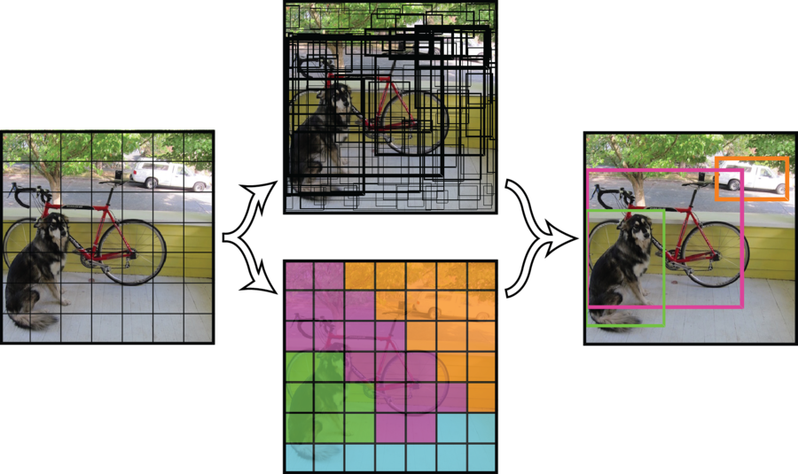
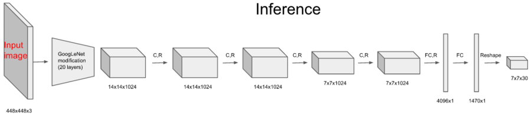
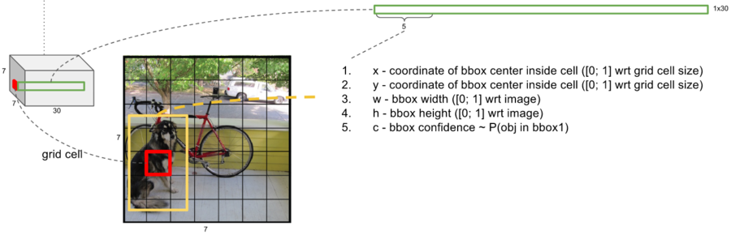

# Object Detection - 얼굴 인식 알고리즘

Face Detection


full scan - image size 줄이면서 detection

얼굴인지 아닌지 test를 십만 번 -> 성능 문제가 아님, 속도 문제이다.

기하학적 변환: rotation, profile


sub-window에서 얼굴 검출

얼굴: 밝은 패턴 - 어두운 패턴으로 구성.

​	이마는 밝고 눈 주변은 어둡다. 눈


Calculate Facial Haar-feature value: Pixel_Sum(Rect_W)-Pixel_Sum(Rect_B)

-> 얼굴 아닌 것도 많이 검출된다.

간단한 분류기로 복잡한 문제를 풀기 = MLP에서 선형 분류기로 비선형 문제 풀기 (Strong Classifier)


Cascade Decision Process : simple binary classifier. 고속으로 분류


## 1. haar-like

```python
import cv2, numpy as np
import math
import time
import random
from matplotlib import pyplot as plt
%matplotlib inline
from bokeh.plotting import figure
from bokeh.io import output_notebook, show, push_notebook


output_notebook()


def imshow(tit, image) :
    plt.title(tit)    
    if len(image.shape) == 3 :
        plt.imshow(cv2.cvtColor(image, cv2.COLOR_BGR2RGB))
    else :
        plt.imshow(image, cmap="gray")
    plt.show()
    
    
def create_win(frames, scale=1.0) :    
    global myImage
    
    all = []
    for f in frames :
        if len(f.shape ) !=  3 : f = cv2.cvtColor(f, cv2.COLOR_GRAY2BGR)
        all.append(f)
    frame = np.vstack(all)
    
    fr=cv2.cvtColor(frame, cv2.COLOR_BGR2RGBA) # because Bokeh expects a RGBA image
    fr=cv2.flip(fr, -1) # because Bokeh flips vertically
    width=fr.shape[1]
    height=fr.shape[0]    

    p = figure(x_range=(0,width), y_range=(0,height), output_backend="webgl", width=int(width*scale), height=int(height*scale))    
    myImage = p.image_rgba(image=[fr], x=0, y=0, dw=width, dh=height)
    show(p, notebook_handle=True)   
    
    
def update_win(frames) :
    
    all = []
    for f in frames :
        if len(f.shape ) !=  3 : f = cv2.cvtColor(f, cv2.COLOR_GRAY2BGR)
        all.append(f)
    frame = np.vstack(all)
    
    fr=cv2.cvtColor(frame, cv2.COLOR_BGR2RGBA)
    fr=cv2.flip(fr, -1)
    myImage.data_source.data['image']=[fr]
    push_notebook()
```


```python
face_classifier = cv2.CascadeClassifier('haarcascade_frontalface_default.xml')
eye_classifier = cv2.CascadeClassifier('haarcascade_eye.xml')

src = cv2.imread('img/kids.png')

faces = face_classifier.detectMultiScale(src)
eyes = eye_classifier.detectMultiScale(src)

for (x, y, w, h) in faces:
    cv2.rectangle(src, (x, y), (x + w, y + h), (255, 0, 255), 2)
imshow('src', src)

for (x, y, w, h) in eyes:
    cv2.rectangle(src, (x, y), (x + w, y + h), (255, 0, 255), 2)
imshow('src', src)
```

이미지는 color, gray 뭐로 읽든 detection은 gray img 상태에서 검출작업이 진행된다.

classifier 리턴값은 좌표이다. (x, y, width, height)


eye classifier는 고주파 성분이 너무 없어서, 눈이 아닌데 눈으로 검출하는 경우가 많다.

이를 해결하기 위해서 얼굴 영역 내에서만 eye detection을 진행한다.

```python
face_classifier = cv2.CascadeClassifier('haarcascade_frontalface_default.xml')
eye_classifier = cv2.CascadeClassifier('haarcascade_eye.xml')

src = cv2.imread('img/kids.png')

faces = face_classifier.detectMultiScale(src)

for (x1, y1, w1, h1) in faces:
        cv2.rectangle(src, (x1, y1), (x1 + w1, y1 + h1), (255, 0, 255), 2)

#        faceROI = src[y1:y1 + h1, x1:x1 + w1]
        faceROI = src[y1:y1 + h1/2, x1:x1 + w1]
# (row,col) 에서 height를 반 나눠서 얼굴의 1/2 위에서만 눈 검출.
        eyes = eye_classifier.detectMultiScale(faceROI)

        for (x2, y2, w2, h2) in eyes:
            center = (int(x2 + w2 / 2), int(y2 + h2 / 2))
            cv2.circle(faceROI, center, int(w2 / 2), (255, 0, 0), 2, cv2.LINE_AA)

imshow('src', src)
```

참고로 행렬은 row, column 순서라 좌표 표현 시 y, x 순서이다.

얼굴의 입을 눈으로 인식하는 경우도 많아서, 얼굴 영역 height를 상단 1/2에서 진행한다.


최근의 CNN base face detector 나오기 전까지는 위의 알고리즘이 시장 장악할 정도로 주요 알고리즘이었다.

## 2. HOG

Histogram of Oriented Gradients

not weak classifier. SVM이라는 strong classifier 사용.

haar-like와는 완전 반대방향.


처음) CCTV에서 사람 검출... 

low-level vision: 각 지점에서의 gradient 구할 수 있다. Orientation vector.

방향성 벡터로 histogram.

청므 만든 사람은 열적외선 카메라 영상으로 사람 감지하는 목적으로 만듦

두 개의 벡터 구할 수 있다. orientation vector, magnitude vector

gradient direction, gradient magnitude.

```python
#full body detector
hog = cv2.HOGDescriptor()
hog.setSVMDetector(cv2.HOGDescriptor_getDefaultPeopleDetector())

frame = cv2.imread("img/people2.jpg")
detected, _ = hog.detectMultiScale(frame)

for (x, y, w, h) in detected:
        c = (random.randint(0, 255), random.randint(0, 255), random.randint(0, 255))
        cv2.rectangle(frame, (x, y), (x + w, y + h), c, 3)

imshow('frame', frame)   
```

SVM: 분류할 수 있는 최전선 벡터: support vector: 전체의 10-15%. 들을 가지고 조합만 하면 되기 때문에 training output data가 많지 않아.

-> HOG 기본 라이브러리에 내장시킴

## 3. ORB

Oriented FASTand Rotated BRIEF

FAST-9 을 이용하여 특징점을 검출한 후 나름의 방법(Intensity Centroid)으로 특징점의 방향(orientation)을 계산


본 거는 잘 찾는데, 일반적인 것은 못 찾아.

특징점이 정확히 같아야 해. (어떻게 보면 제약적)

보편적인 얼굴, 사람, 강아지를 찾아주세요 -> 부적합.

도메인 별로 가정해야 할 것이 있다.


local descriptor

scaling, rotation 덜 민감하게 다 찾아냄.

샘플 중 가장 비슷한 이미지 찾기 가능 -> 위치 찾기도 가능하다는 의미.

```python
test = cv2.imread("img/book1test.jpg", cv2.IMREAD_GRAYSCALE)
keypoints, desc = orb.detectAndCompute(test, None)


min_distance = 1000
idx = -1
for i in range(len(images)) :   
    matches = matcher.match(desc, database_desc[i])
    matches = sorted(matches, key=lambda x: x.distance)
    good_matches = matches[:50]
    
    distance = 0
    for d  in good_matches :
        distance += d.distance
    distance /= len(good_matches)    #50개 점의 평균 거리
    print(distance)
        
    if  min_distance > distance :    #의 minimum 구하기
        min_distance = distance
        idx = i

imshow("", test  )
imshow("", cv2.imread(images[idx])      )
```

```python
src1 = cv2.imread('img/box.png', cv2.IMREAD_GRAYSCALE)
src2 = cv2.imread('img/box_in_scene.png', cv2.IMREAD_GRAYSCALE)
    
keypoints1, desc1 = orb.detectAndCompute(src1, None)
keypoints2, desc2 = orb.detectAndCompute(src2, None)

matches = matcher.match(desc1, desc2)
matches = sorted(matches, key=lambda x: x.distance)
good_matches = matches[:50]

pts1 = np.array([keypoints1[m.queryIdx].pt for m in good_matches]).reshape(-1, 1, 2).astype(np.float32)
pts2 = np.array([keypoints2[m.trainIdx].pt for m in good_matches]).reshape(-1, 1, 2).astype(np.float32)
```


매칭점 50개, 9개 파라미터 구해야 함. 최소 9개의 매칭점 필요.

그 중에는 error도 있고. 이상점은 자동으로 감지하여 제거하고

가장 좋은 점을 내부적으로 h value 계산


pts1: 첫번째 영상에서의 매칭된 점의 키포인트. 첫번째 이미지에서의 포인트 정보를 가져와.


affine: 2d transformation

perspective: 3d transformation

### scene에서 object 찾기

```python
def findBook(query,scene):
    src1 = cv2.cvtColor(query, cv2.COLOR_BGR2GRAY)
    src2 = cv2.cvtColor(scene, cv2.COLOR_BGR2GRAY)
    
    keypoints1, desc1 = orb.detectAndCompute(src1, None)
    keypoints2, desc2 = orb.detectAndCompute(src2, None)

    matches = matcher.match(desc1, desc2)
    matches = sorted(matches, key=lambda x: x.distance)
    good_matches = matches[:50]
    
    pts1 = np.array([keypoints1[m.queryIdx].pt for m in good_matches]).reshape(-1, 1, 2).astype(np.float32)
    pts2 = np.array([keypoints2[m.trainIdx].pt for m in good_matches]).reshape(-1, 1, 2).astype(np.float32)
    
    H, _ = cv2.findHomography(pts1, pts2, cv2.RANSAC)

    (h,w)=src1.shape[:2]
    corners1 = np.array([[0,0],[0,h-1],[w-1,h-1],[w-1,0]]).reshape(-1,1,2).astype(np.float32)
    corners2 = cv2.perspectiveTransform(corners1, H)
#    return corners2
    return np.int32(corners2)


q = cv2.imread('img/dog_test.jpg')
s = cv2.imread('img/dog.jpg')

corner = findBook(q,s)

cv2.polylines(s, [corner], True, (0,255,0), 2, cv2.LINE_AA)

imshow("",s)
```


## 4. YOLO

굉장히 잘 검출된다.

size, 비율 상관없이 잘 뽑는다.

동영상에서 테스트할 경우 극명하게 테스트 가능하다. 자율주행이 핫이슈라 자율주행 영상에 테스트해봐.

30 frames 스킵해가며 1초에 한 번 정도만 detection하면 되겠지.


YOLO: PC에서 트레이닝 불가 (최대cpu 다 사용)


새로운.. 많이 다를거야.

YOLO에서 주는 건 제한적. 네트웍 통과시킨 결과만 줘.

그래도 획기적인 알고리즘.


# LBS (Location-based Service)

마케팅 수단으로 주목받는 분야


## fashion mnist

10개를 분류하려 한다.

5개만 분류 학습시킨다 (빠름)

~ DNN

+data augmentation


(200129)

Semantic Segmentation to Instance Segmentation

Semantic Image Segmentation의 목적은 사진에 있는 모든 픽셀을 해당하는 (미리 지정된 개수의) class로 분류하는 것입니다. 이미지에 있는 모든 픽셀에 대한 예측을 하는 것이기 때문에 dense prediction 이라고도 불립니다.


# YOLO

기존에 detection 오래 걸린 이유: full scanning

YOLO는 scanning 기법을 안 쓰고

YOLO는 네트워크의 최종 출력단에서 경계박스를 위치 찾기와 클래스 분류가 동시에 이뤄진다.

단 하나의 네트워크가 한번에 특징도 추출하고, 경계박스도 만들고, 클래스도 분류한다.

그러므로 간단하고 빠르다

## 소요시간 비교

R-CNN (20s): 영상에서 object가 있을 만한 좋은 위치를 찾아. (edge 기반으로) -> 그곳을 CNN (검색범위 줄음

Fast R-CNN (0.5fps)

Faster R-CNN (7-8fps)

YOLO (45fps, 155fps)


R-CNN은 region proposal이라는 수백개의 이미지 후보를 생성하고 각각의-

YOLO: 격자 그리드로 나누어 한번에 클래스를 판단하고 이를 통합해 최종 객체를 구분한다.

기존의 방법들과 달리 object detection을 이미지 픽셀 좌표에 대응되는 bounding box을 찾는다.

이에 대한 class 확률을 구하는 single regression problem으로 해결한다.

## 알고리즘

Input image를 S X S grid로 분할 (해당 셀에 물체의 중심 위치로 가정)

cell은 B개의 bounding box와 각 객체 존재에 대한 confidence score로 구성

cell은 C개의 클래스 확률로 구성 박스

결과적으로 마지막 rpediction layer는 S x S x (B * 5 + C) 사이즈가 된다.


각 cell마다 box configuration(t_x, t_y, t_w, t_h), p0(c, object일 확률), pi(class별 확률) 파라미터를 가진다.

각 셀에 confidence (some object일 확률)

bounding box : 2개(YOLO ver.2) (3개 in ver.3)


box 제거: object confidence 낮은 것 제거 ->  사각형 합치는.. Non-Maximum Suppresision (NMS:opencv에 구현되어 있음)




좌측의 입력 영상이 네트워크를 통과하면 중앙의 2개의 데이터를 얻는다.

이것이 네트워크의 최종 출력이다.

이안에는 수많은 경계 박스들과 영상을 7x7그리드로 나눴을 때 해당 그리드 셀안에는 어떤 클래스가 있는지에 대한 정보(위 중앙 그림 2개)가 인코딩되어 있다.

우측의 이미지는 네트워크의 최종 출력물을 이용해 생성하는 것으로 네트워크가 직접 생성한 것이 아니다.

가운데 위쪽은 경계 박스에 대한 정보이다. 서로 다른 크기의 상당히 많은 경계박스들이 그려져 있다.

복잡해보여서 언뜻 봐서는 뭐가 뭔지 알 수가 없는것 같다.

네트워크는 영상을 7x7 그리드로 나눈다. 각 그리드에서 중심을 그리드 안쪽으로 하면서 크기가 일정하지 않은 경계박스를 2개씩 생성한다.

그리드 셀이 7 * 7 = 49 개이므로 경계 박스는 총 98개가 만들어 진다.

 

이 중 경계 박스 안쪽에 어떤 오브젝트가 있을 것 같다고 확신(confidence score)할수록 박스를 굵게 그려준다.

굵은 경계 박스들만 남기고 얇은 경계박스(어떤 오브젝트도 없는 것 같다고 생각되는 것들) 을 지운다.

남은 후보 경계 박스들을 NMS(Nom-maximal suppression 비-최대값 억제) 알고리즘를 이용해 선별하면 우측의 이미지 처럼 3개만 남게 된다.

남은건 경계 박스의 색깔이다. 

경계 박스의 색깔은 클래스를 의미한다. 

중앙의 아래쪽에 이미지가 7x7 의 격자(그리드)로 분할되어 총 49개의 그리드 셀이 만들어졌다.

각 그리드 셀은 해당 영역에서 제안한(proposal) 경계 박스안의 오브젝트가 어떤 클래스인지를 컬러로 표현하고 있다.

그러므로 최종적으로 남은 3개의 경계 박스 안에 어떠한 클래스가 있는지 알 수 있다.

그래서 우측의 최종 결과를 얻는다.

네트워크가 생성하는 경계박스의 숫자는 그리드 셀의 2배이다. 

그리드 셀이 49개이므로 경계 박스는 총 98개가 만들어 진다.

ROI 혹은 오브젝트 후보라고 할 수 있는 이 경계박스들은 스레시홀드(0.5)보다 작으면 지워준다.



네트워크 구조는 직선적이다. 

GoogleLeNet을 약간 변형시켜서 특징 추출기로 사용했다.

이후 컨볼루션 레이어 4회, 풀 커넥션 레이어 2번 하고 사이즈를 7x7x30으로 조정하면 끝난다.

이 마지막 특징 데이터 7x7x30 가 바로 예측 결과이며 이 안에 경계박스와 클래스 정보 등 모든 것이 들어 있다.

무엇이 들어있는지 자세히 보자.



왼쪽 빨간점으로 표시한 부분은 7x7 그리드셀중에 하나로 이미지에서 개의 중앙 부분에 해당한다.

그리고 빨간색 박스보다 큰 **노란색 박스**가 바로 빨간색 그리드셀에서 예측한 경계 박스이다.

 

7x7 은 영상을 7x7 의 격자로 나눈것이다.

30개의 채널은 (경계 박스의 정보 4개 , 경계 박스안에 오브젝트가 있을 확률(confidence)) x 2, 어떤 클래스일 확률 20개 로 구성된다.

경계 박스 정보 x, y : 노란색 경계 박스의 중심이 빨간 격자 셀의 중심에서 어디에 있는가.

경계 박스 정보 w,h : 노란색 경계 박스의 가로 세로 길이가 전체 이미지 크기에 어느 정도 크기를 갖는가

만약 경계박스가 위의 그림처럼 되었다면 x,y는 모두 0.5 정도이고 w,h는 각각  2/7, 4/7 정도가 될 것이다.

노란색 경계 박스는 반드시 그 중심이 빨간 그리드 셀 안에 있어야 하며, 가로와 세로길이는 빨간 그리드 셀보다 작을 수도 있고 그림처럼 클 수도 있다.

또한 정사각형일 필요도 없다.

빨간 그리드 셀 내부 어딘가를 중심으로 하여 근처에 있는 어떤 오브젝트를 둘러싸는 직사각형의 노란색 경계 박스를 그리는 것이 목표이다.

노란색 경계 박스가 바로 ROI , 오브젝트 후보이다.

이것을 2개 만든다.

## Code

```python
# Initialize the parameters
confThreshold = 0.5  #Confidence threshold
nmsThreshold = 0.4   #Non-maximum suppression threshold
inpWidth = 416       #Width of network's input image
inpHeight = 416      #Height of network's input image

# Load names of classes
classesFile = "200128_dark/coco.names"
classes = None
with open(classesFile, 'rt') as f:
    classes = f.read().rstrip('\n').split('\n')
print(classes)
# Give the configuration and weight files for the model and load the network using them.
modelConfiguration = "200128_dark/yolov3.cfg"
modelWeights = "../../../../yolov3.weights"

net = cv2.dnn.readNetFromDarknet(modelConfiguration, modelWeights)
net.setPreferableBackend(cv2.dnn.DNN_BACKEND_OPENcv2)
net.setPreferableTarget(cv2.dnn.DNN_TARGET_CPU)
```

- Confidence threshold (c): object일 확률

- NMS threshold: 거리가 얼마나 떨어져있냐

​	주변보다 상대적으로 값이 높거나 낮은 값만 선택.

​	local maximum/minimum value만 뽑겠다는 것.

​	(harris corner에서의 여러 개 엣지 나온 다음에 좋은 코너값 보기 이해, 주변보다 값이 낮거나 높은 것만 뽑는 것과 같다.)

- size of network's input image: is fixed as 416 x 416 in YOLO ver.3
  (YOLO network)

- variable은 confThreshold, nmsThreshold 두 개.

- YOLO에서 필요한 파일은 Model Configuration, Model Weights 두 개.
  YOLO는 tensorflow가 아닌 독자적인 format이라서 configuration file 필요: ini format.
  [yolo]의 classes, [convolutional]의 filters 수정해야 한다.

```python
# Get the names of the output layers
def getOutputsNames(net):
    # Get the names of all the layers in the network
    layersNames = net.getLayerNames()
    # Get the names of the output layers, i.e. the layers with unconnected outputs
    return [layersNames[i[0] - 1] for i in net.getUnconnectedOutLayers()]

# Draw the predicted bounding box
def drawPred(classId, conf, left, top, right, bottom):
    # Draw a bounding box.
    cv2.rectangle(frame, (left, top), (right, bottom), (255, 178, 50), 3)
    
    label = '%.2f' % conf
        
    # Get the label for the class name and its confidence
    if classes:
        assert(classId < len(classes))
        label = '%s:%s' % (classes[classId], label)

    #Display the label at the top of the bounding box
    labelSize, baseLine = cv2.getTextSize(label, cv2.FONT_HERSHEY_SIMPLEX, 0.5, 1)
    top = max(top, labelSize[1])
    cv2.rectangle(frame, (left, top - round(1.5*labelSize[1])), (left + round(1.5*labelSize[0]), top + baseLine), (255, 255, 255), cv2.FILLED)
    cv2.putText(frame, label, (left, top), cv2.FONT_HERSHEY_SIMPLEX, 0.75, (0,0,0), 1)

# Remove the bounding boxes with low confidence using non-maxima suppression
def postprocess(frame, outs):
    frameHeight = frame.shape[0]
    frameWidth = frame.shape[1]

    # Scan through all the bounding boxes output from the network and keep only the
    # ones with high confidence scores. Assign the box's class label as the class with the highest score.
    classIds = []
    confidences = []
    boxes = []
    for out in outs:
        for detection in out:
            scores = detection[5:]
            classId = np.argmax(scores)
            confidence = scores[classId]
            if confidence > confThreshold:
                center_x = int(detection[0] * frameWidth)
                center_y = int(detection[1] * frameHeight)
                width = int(detection[2] * frameWidth)
                height = int(detection[3] * frameHeight)
                left = int(center_x - width / 2)
                top = int(center_y - height / 2)
                classIds.append(classId)
                confidences.append(float(confidence))
                boxes.append([left, top, width, height])

    # Perform non maximum suppression to eliminate redundant overlapping boxes with
    # lower confidences.
    indices = cv2.dnn.NMSBoxes(boxes, confidences, confThreshold, nmsThreshold)
    for i in indices:
        i = i[0]
        box = boxes[i]
        left = box[0]
        top = box[1]
        width = box[2]
        height = box[3]
        drawPred(classIds[i], confidences[i], left, top, left + width, top + height)
```

YOLO는 출력 레이어가 세 개이다. (이전까지는 하나였는데)

`net.getLayerNames()` 모든 레이어들 출력

`net.getUnconnectedOutLayers()` 끊긴(output) 레이어들 출력

```python
[[200]
 [227]
 [254]]
```

`net.getUnconnectedOutLayers().i` : [200]

`net.getUnconnectedOutLayers().i[0]` : 200

## YOLO Installation

