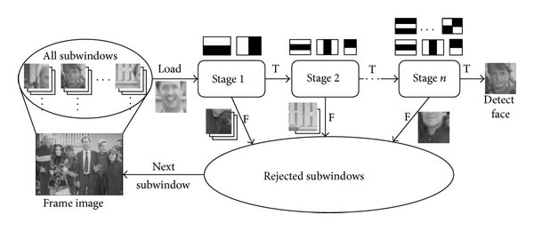

# Object Detection - 얼굴 인식 알고리즘

Face Detection


full scan - image size 줄이면서 detection

얼굴인지 아닌지 test를 십만 번 -> 성능 문제가 아님, 속도 문제이다.

기하학적 변환: rotation, profile


sub-window에서 얼굴 검출

얼굴: 밝은 패턴 - 어두운 패턴으로 구성.

​	이마는 밝고 눈 주변은 어둡다. 눈



Calculate Facial Haar-feature value: Pixel_Sum(Rect_W)-Pixel_Sum(Rect_B)

-> 얼굴 아닌 것도 많이 검출된다.

간단한 분류기로 복잡한 문제를 풀기 = MLP에서 선형 분류기로 비선형 문제 풀기 (Strong Classifier)


Cascade Decision Process : simple binary classifier. 고속으로 분류


## 1. haar-like

```python
import cv2, numpy as np
import math
import time
import random
from matplotlib import pyplot as plt
%matplotlib inline
from bokeh.plotting import figure
from bokeh.io import output_notebook, show, push_notebook


output_notebook()


def imshow(tit, image) :
    plt.title(tit)    
    if len(image.shape) == 3 :
        plt.imshow(cv2.cvtColor(image, cv2.COLOR_BGR2RGB))
    else :
        plt.imshow(image, cmap="gray")
    plt.show()
    
    
def create_win(frames, scale=1.0) :    
    global myImage
    
    all = []
    for f in frames :
        if len(f.shape ) !=  3 : f = cv2.cvtColor(f, cv2.COLOR_GRAY2BGR)
        all.append(f)
    frame = np.vstack(all)
    
    fr=cv2.cvtColor(frame, cv2.COLOR_BGR2RGBA) # because Bokeh expects a RGBA image
    fr=cv2.flip(fr, -1) # because Bokeh flips vertically
    width=fr.shape[1]
    height=fr.shape[0]    

    p = figure(x_range=(0,width), y_range=(0,height), output_backend="webgl", width=int(width*scale), height=int(height*scale))    
    myImage = p.image_rgba(image=[fr], x=0, y=0, dw=width, dh=height)
    show(p, notebook_handle=True)   
    
    
def update_win(frames) :
    
    all = []
    for f in frames :
        if len(f.shape ) !=  3 : f = cv2.cvtColor(f, cv2.COLOR_GRAY2BGR)
        all.append(f)
    frame = np.vstack(all)
    
    fr=cv2.cvtColor(frame, cv2.COLOR_BGR2RGBA)
    fr=cv2.flip(fr, -1)
    myImage.data_source.data['image']=[fr]
    push_notebook()
```


```python
face_classifier = cv2.CascadeClassifier('haarcascade_frontalface_default.xml')
eye_classifier = cv2.CascadeClassifier('haarcascade_eye.xml')

src = cv2.imread('img/kids.png')

faces = face_classifier.detectMultiScale(src)
eyes = eye_classifier.detectMultiScale(src)

for (x, y, w, h) in faces:
    cv2.rectangle(src, (x, y), (x + w, y + h), (255, 0, 255), 2)
imshow('src', src)

for (x, y, w, h) in eyes:
    cv2.rectangle(src, (x, y), (x + w, y + h), (255, 0, 255), 2)
imshow('src', src)
```

이미지는 color, gray 뭐로 읽든 detection은 gray img 상태에서 검출작업이 진행된다.

classifier 리턴값은 좌표이다. (x, y, width, height)


eye classifier는 고주파 성분이 너무 없어서, 눈이 아닌데 눈으로 검출하는 경우가 많다.

이를 해결하기 위해서 얼굴 영역 내에서만 eye detection을 진행한다.

```python
face_classifier = cv2.CascadeClassifier('haarcascade_frontalface_default.xml')
eye_classifier = cv2.CascadeClassifier('haarcascade_eye.xml')

src = cv2.imread('img/kids.png')

faces = face_classifier.detectMultiScale(src)

for (x1, y1, w1, h1) in faces:
        cv2.rectangle(src, (x1, y1), (x1 + w1, y1 + h1), (255, 0, 255), 2)

#        faceROI = src[y1:y1 + h1, x1:x1 + w1]
        faceROI = src[y1:y1 + h1/2, x1:x1 + w1]
# (row,col) 에서 height를 반 나눠서 얼굴의 1/2 위에서만 눈 검출.
        eyes = eye_classifier.detectMultiScale(faceROI)

        for (x2, y2, w2, h2) in eyes:
            center = (int(x2 + w2 / 2), int(y2 + h2 / 2))
            cv2.circle(faceROI, center, int(w2 / 2), (255, 0, 0), 2, cv2.LINE_AA)

imshow('src', src)
```

참고로 행렬은 row, column 순서라 좌표 표현 시 y, x 순서이다.

얼굴의 입을 눈으로 인식하는 경우도 많아서, 얼굴 영역 height를 상단 1/2에서 진행한다.


최근의 CNN base face detector 나오기 전까지는 위의 알고리즘이 시장 장악할 정도로 주요 알고리즘이었다.

## 2. HOG

Histogram of Oriented Gradients

not weak classifier. SVM이라는 strong classifier 사용.

haar-like와는 완전 반대방향.


처음) CCTV에서 사람 검출... 

low-level vision: 각 지점에서의 gradient 구할 수 있다. Orientation vector.

방향성 벡터로 histogram.

청므 만든 사람은 열적외선 카메라 영상으로 사람 감지하는 목적으로 만듦

두 개의 벡터 구할 수 있다. orientation vector, magnitude vector

gradient direction, gradient magnitude.

```python
#full body detector
hog = cv2.HOGDescriptor()
hog.setSVMDetector(cv2.HOGDescriptor_getDefaultPeopleDetector())

frame = cv2.imread("img/people2.jpg")
detected, _ = hog.detectMultiScale(frame)

for (x, y, w, h) in detected:
        c = (random.randint(0, 255), random.randint(0, 255), random.randint(0, 255))
        cv2.rectangle(frame, (x, y), (x + w, y + h), c, 3)

imshow('frame', frame)   
```

SVM: 분류할 수 있는 최전선 벡터: support vector: 전체의 10-15%. 들을 가지고 조합만 하면 되기 때문에 training output data가 많지 않아.

-> HOG 기본 라이브러리에 내장시킴

## 3. ORB

Oriented FASTand Rotated BRIEF

FAST-9 을 이용하여 특징점을 검출한 후 나름의 방법(Intensity Centroid)으로 특징점의 방향(orientation)을 계산


본 거는 잘 찾는데, 일반적인 것은 못 찾아.

특징점이 정확히 같아야 해. (어떻게 보면 제약적)

보편적인 얼굴, 사람, 강아지를 찾아주세요 -> 부적합.

도메인 별로 가정해야 할 것이 있다.


local descriptor

scaling, rotation 덜 민감하게 다 찾아냄.

샘플 중 가장 비슷한 이미지 찾기 가능 -> 위치 찾기도 가능하다는 의미.

```python
test = cv2.imread("img/book1test.jpg", cv2.IMREAD_GRAYSCALE)
keypoints, desc = orb.detectAndCompute(test, None)


min_distance = 1000
idx = -1
for i in range(len(images)) :   
    matches = matcher.match(desc, database_desc[i])
    matches = sorted(matches, key=lambda x: x.distance)
    good_matches = matches[:50]
    
    distance = 0
    for d  in good_matches :
        distance += d.distance
    distance /= len(good_matches)    #50개 점의 평균 거리
    print(distance)
        
    if  min_distance > distance :    #의 minimum 구하기
        min_distance = distance
        idx = i

imshow("", test  )
imshow("", cv2.imread(images[idx])      )
```

```python
src1 = cv2.imread('img/box.png', cv2.IMREAD_GRAYSCALE)
src2 = cv2.imread('img/box_in_scene.png', cv2.IMREAD_GRAYSCALE)
    
keypoints1, desc1 = orb.detectAndCompute(src1, None)
keypoints2, desc2 = orb.detectAndCompute(src2, None)

matches = matcher.match(desc1, desc2)
matches = sorted(matches, key=lambda x: x.distance)
good_matches = matches[:50]

pts1 = np.array([keypoints1[m.queryIdx].pt for m in good_matches]).reshape(-1, 1, 2).astype(np.float32)
pts2 = np.array([keypoints2[m.trainIdx].pt for m in good_matches]).reshape(-1, 1, 2).astype(np.float32)
```


매칭점 50개, 9개 파라미터 구해야 함. 최소 9개의 매칭점 필요.

그 중에는 error도 있고. 이상점은 자동으로 감지하여 제거하고

가장 좋은 점을 내부적으로 h value 계산


pts1: 첫번째 영상에서의 매칭된 점의 키포인트. 첫번째 이미지에서의 포인트 정보를 가져와.


affine: 2d transformation

perspective: 3d transformation

### scene에서 object 찾기

```python
def findBook(query,scene):
    src1 = cv2.cvtColor(query, cv2.COLOR_BGR2GRAY)
    src2 = cv2.cvtColor(scene, cv2.COLOR_BGR2GRAY)
    
    keypoints1, desc1 = orb.detectAndCompute(src1, None)
    keypoints2, desc2 = orb.detectAndCompute(src2, None)

    matches = matcher.match(desc1, desc2)
    matches = sorted(matches, key=lambda x: x.distance)
    good_matches = matches[:50]
    
    pts1 = np.array([keypoints1[m.queryIdx].pt for m in good_matches]).reshape(-1, 1, 2).astype(np.float32)
    pts2 = np.array([keypoints2[m.trainIdx].pt for m in good_matches]).reshape(-1, 1, 2).astype(np.float32)
    
    H, _ = cv2.findHomography(pts1, pts2, cv2.RANSAC)

    (h,w)=src1.shape[:2]
    corners1 = np.array([[0,0],[0,h-1],[w-1,h-1],[w-1,0]]).reshape(-1,1,2).astype(np.float32)
    corners2 = cv2.perspectiveTransform(corners1, H)
#    return corners2
    return np.int32(corners2)


q = cv2.imread('img/dog_test.jpg')
s = cv2.imread('img/dog.jpg')

corner = findBook(q,s)

cv2.polylines(s, [corner], True, (0,255,0), 2, cv2.LINE_AA)

imshow("",s)
```


## 4. YOLO

굉장히 잘 검출된다.

size, 비율 상관없이 잘 뽑는다.

동영상에서 테스트할 경우 극명하게 테스트 가능하다. 자율주행이 핫이슈라 자율주행 영상에 테스트해봐.

30 frames 스킵해가며 1초에 한 번 정도만 detection하면 되겠지.


새로운.. 많이 다를거야.

YOLO에서 주는 건 제한적. 네트웍 통과시킨 결과만 줘.

그래도 획기적인 알고리즘.


# LBS (Location-based Service)

마케팅 수단으로 주목받는 분야


## fashion mnist

10개를 분류하려 한다.

5개만 분류 학습시킨다 (빠름)

~ DNN

+data augmentation


YOLO: PC에서 트레이닝 불가 (최대cpu 다 사용)


