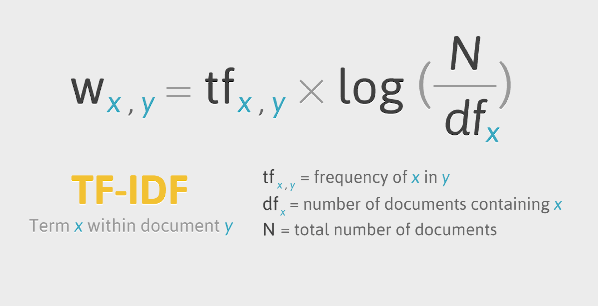

# 자연어 처리 (NLP)

컴퓨터 과학, 인공지능, 언어학이 합쳐진 분야이다.


#### 자연어 처리 업무

난이도 쉬움:	스펠링 체크, 키워드 검사, 유사어 감지

난이도 중간:	웹사이트 및 서류의 형태 해석, 구문해석

​							ex) 영수증 해석

난이도 어려움:기계번역, 감정분석, 질의응답 시스템


#### 자연어 처리의 어려움

언어,상황,환경,지각 지식의 학습 및 표현의 복잡함 -> Rule 기반만으로는 무리인가?

영상은 벡터로 분석, 수치화 가능했다. 그런데 언어는? 기존의 알고리즘을 적용하기 어렵다.

DNN은 분산표현의 장점으로 인해 모호하지만 풍부한 정보를 얻을 수 있다. -> 단어의 벡터화로부터 시작

## 언어 데이터의 특성

불연속적인 심볼의 sequence			(영상, 음성은 연속적이다. Text는 불연속적)

계열 길이가 샘플에 따라 다르다

계층적, 재귀적인 구조를 지닌다. (문자, 단어, 구, 문)


1. 계열 -> 계열
   - 형태소 해석
   - 기계번역, 자동요약
   - 질의응답, 챗봇
2. 계열 -> tree 구조                    초반에 많이 했던 것. 어렵다. 알고리즘 보진 않을 거고 갖다 쓸 거야.
   - 구문 해석
3. 계열 -> 그래프 구조                연구가 많이 이뤄지고 있진 않다. 문맥을 이해하는 부분.
   - 의미해석

단어의 국소표현: 단어를 벡터로 (one-hot encoding과 비슷) 한다면 -> 단어의 의미를 파악하는 벡터가 필요, 차원이 매우 커진다.

### 분포가설

비슷한 문맥을 가진 단어는 비슷한 의미를 가진다. = 현대의 통계적 자연어 처리에서 획기적인 발상

크게 2종류이다.

- count-based methods
  - ex) SVD(LSA), HAL
  - 단어, 문맥 **출현 횟수를 세는** 방법

- predictive methods
  - ex) NPLM, ...
  - 학습을 해서(특징을 만듦) 연산도 가능(단어 간 거리 측정 가능), 예측하는...

자연어 처리의 기반은 rule base이다.

규칙을 이용한 학습.

가위바위보 규칙

`-1 % 3` = `(-1+3) % 3` = 2

0:비김, 1:이김, 2:짐

# NLP Basic

- 설치

```python
pip install gensim			#단어들을 벡터로 만드는 알고리즘
pip install wordcloud		#구름 그리기
pip install konlpy --user	#한국어 형태소 분석
pip install jpype1		#윈도우에서 안 돼서 아래 라인 코드로 설치
conda install -c conda -forge jpype1	#depending konlpy library. 자바기반. ----- 오류남
```

```python
import numpy as np
from sklearn.naive_bayes import GaussianNB
from sklearn.metrics import accuracy_score
from sklearn.feature_extraction.text import CountVectorizer
from sklearn.feature_extraction.text import TfidfVectorizer
from sklearn.metrics.pairwise import cosine_similarity
from sklearn.linear_model import SGDClassifier
from sklearn.svm import LinearSVC
from tensorflow.keras.datasets import imdb
from konlpy.tag import Twitter
from konlpy.tag import Okt
from konlpy.tag import Kkma 
from konlpy.tag import Twitter
from pprint import pprint
import nltk
from nltk.classify.scikitlearn import SklearnClassifier
from wordcloud import WordCloud, STOPWORDS
from gensim import corpora, models
import numpy  as np
from PIL import Image
from wordcloud import ImageColorGenerator
import glob
import re
import matplotlib.pyplot as plt
from tensorflow.keras.preprocessing.text import Tokenizer
from tensorflow.keras.preprocessing.sequence import pad_sequences
%matplotlib inline
```

## 1. char 코드 기반 자연어 처리

언어마다 히스토그램을 분석하여 각 캐릭터의 분포를 구한다 - 특정 코드의 빈도수를 계산하는 방법

```python
ko_str = '이것은 한국어 문장입니다.'
ja_str = 'これは日本語の文章です。'
en_str = 'This is English Sentences.'
ch_str = '统一码'

print(ord(ko_str[0]))	#51060
print(ord(ja_str[0]))	#12371
print(ord(en_str[0]))	#84
print(ord(ch_str[0]))	#32479
```

유니코드는 9byte. 코드가 0~65535번까지 있다.

`ord()` : 아스키코드(쉽게 생각해서 유니코드)로 변환

주어진 문장에 대해 히스토그램이 계산된다.

벡터의 65535개 요소 중 대부분의 요소는 0일 것이다. -> 굉장히 비효율적이다.

```python
# Unicode 코드 포인트로 출현 빈도 판정하기 --- (*1)
def count_codePoint(str):
    # Unicode 코드 포인트를 저장할 배열 준비하기 --- (*2)
    counter = np.zeros(65535)
    for i in range(len(str)):
        # 각 문자를 Unicode 코드 포인트로 변환하기 --- (*3)
        code_point = ord(str[i])
        if code_point > 65535 :
            continue
        # 출현 횟수 세기 --- (*4)
        counter[code_point] += 1

    # 각 요소를 문자 수로 나눠 정규화하기 --- (*5)
    counter = counter/len(str)
    return counter
```

```python
# 학습 전용 데이터 준비하기
ko_str = '이것은 한국어 문장입니다.'
ja_str = 'これは日本語の文章です。'
en_str = 'This is English Sentences.'

x_train = [count_codePoint(ko_str),count_codePoint(ja_str),count_codePoint(en_str)]
y_train = ['ko','ja','en']
```

```python
print(  x_train[0]  )					#[0. 0. 0. ... 0. 0. 0.]
print(  np.where(x_train[0] > 0)  )		#(array([   32,    46, 44163, 44397, 45768, 45796, 47928, 50612, 51008, 51060, 51077, 51109, 54620], dtype=int64),)

data = x_train[0]
print(  data[[32,46,44163]]  )			#[0.14285714 0.07142857 0.07142857]

idx = np.where(x_train[0] > 0)
data = x_train[0]
print(  data[idx]  )					#[0.14285714 0.07142857 0.07142857 0.07142857 0.07142857 0.07142857 0.07142857 0.07142857 0.07142857 0.07142857 0.07142857 0.07142857 0.07142857]
```

`variable[[idx1, idx2, idx3, ...]]` : particle slicing 방법으로 해당 idx의 값을 가져오는 방법이다.

```python
#X = np.array([[-1, -1], [3, 2]])
#Y = np.array([1,  2])

X = np.array([[-1, -1], [-2, -1], [-3, -2], [1, 1], [2, 1], [3, 2]])
Y = np.array(['r', 'r', 'r', 'b', 'b', 'b'])


color = [ 'red' if y == 'r' else 'blue' for y in Y]

plt.scatter(X[:, 0], X[:, 1], color=color)

t = np.array([[-0.8, -1]])

plt.scatter(t[:,0], t[:,1], color='yellow')
```

```python
clf = GaussianNB()
clf.fit(X,Y)          #학습: mean, sd 구하는 것.
print(clf.predict[[-0.8,-1]])
```

딥러닝은 데이터가 많아야 의미있는 결론이 나오는데, 여기는 데이터가 적어 적용하지 않는다. 차원수가 65k개면 샘플수도 그만큼은 있어야 딥러닝이 가능하다.

GaussianNB 학습(naive bayesian) : mean, sd를 구하는 것으로 데이터가 하나여도 동작한다.

Y값은 참고하는 label일 뿐이어서 값이 숫자가 아니어도 괜찮다.

```python
#학습하기
clf = GaussianNB()
clf.fit(x_train, y_train)
```

```python
# 평가 전용 데이터 준비하기
ko_test_str = '안녕. 어디야'
ja_test_str = 'こんにちは'
en_test_str = 'Hello'
x_test = [count_codePoint(en_test_str),count_codePoint(ja_test_str),count_codePoint(ko_test_str)]
#자연어 자체로 읽을 수 없어. 한 번은 변환이 필요해. feature를 transformation
y_test = ['en', 'ja', 'ko']

# 평가하기 --- (*7)
y_pred = clf.predict(x_test)
print(y_pred)
print("정답률 = " , accuracy_score(y_test, y_pred))
```

## 2. 단어 빈도수 기반 자연어 처리

### 단어 빈도수 기반

#### CountVectorizer

단어 문서 행렬(term-document matrix: 이하 TDM)는 문서별로 나타난 단어의 빈도를 표(행렬) 형태로 나타낸 것이다.

- 문장들

```python
corpus = [
    'you know I want your love',
    'I like you',
    'what should I do'
]
```

- split 혹은 dictionary

```python
str = " ".join(corpus)
print(str)

words = str.split(' ')
print(words)

freq = {}							#dictionary는 초기화 필수
for w in words :
    #freq[w] +=1  #오류남
    freq[w] = freq.get(w,0) + 1		#default 값을 주기 위해

print(freq)
```

`freq[w]=freq[w]+1` : 딕셔너리는 없는 dict 넣으면 자동으로 생성되나, 이건 오류난다. 읽고쓰기를 동시에 하는데 읽을 때 값이 없기 때문이다.

```bash
#result
you know I want your love I like you what should I do
['you', 'know', 'I', 'want', 'your', 'love', 'I', 'like', 'you', 'what', 'should', 'I', 'do']
{'you': 2, 'know': 1, 'I': 3, 'want': 1, 'your': 1, 'love': 1, 'like': 1, 'what': 1, 'should': 1, 'do': 1}
```

- vectorize

`CountVectorizer()` : 문장을 count로 변환해서 벡터화. one-hot encoding과 비슷. 1은 하나 이상 있다는 뜻

`fit_transform(문장)` : fit과 transform 두 개의 메소드를 합친 것이다.

`CountVectorizer().fit_transform(문장).toarray()` : 요소들은 feature의 순서이다.

```python
vector = CountVectorizer()
tf = vector.fit_transform(corpus)
```

```bash
print(tf)
#result
  (0, 7)	1
  (0, 1)	1
  (0, 5)	1
  (0, 8)	1
  (0, 3)	1
  (1, 7)	1
  (1, 2)	1
  (2, 6)	1
  (2, 4)	1
  (2, 0)	1
print(tf.toarray())
#result
[[0 1 0 1 0 1 0 1 1]
 [0 0 1 0 0 0 0 1 0]
 [1 0 0 0 1 0 1 0 0]]

print(type(tf))		# <class 'scipy.sparse.csr.csr_matrix'>
print(tf.shape)		# (3, 9) = (문장, 단어수)
```

- CountVectorizer() 객체 출력

```python
print(vector)
#각 단어의 인덱스가 어떻게 부여되었는지 보여준다.
#result
CountVectorizer(analyzer='word', binary=False, decode_error='strict',
                dtype=<class 'numpy.int64'>, encoding='utf-8', input='content',
                lowercase=True, max_df=1.0, max_features=None, min_df=1,
                ngram_range=(1, 1), preprocessor=None, stop_words=None,
                strip_accents=None, token_pattern='(?u)\\b\\w\\w+\\b',
                tokenizer=None, vocabulary=None)

print(vector.vocabulary_['you'])		#7
print(vector.vocabulary_.get('you'))	#7
```

- feature name : TDM에 저장된 단어들

```python
words = vector.get_feature_names()
for word in words: print(word)
    
for key in vector.vocabulary_: 
    print(key, vector.vocabulary_[key])

res = sorted([vector.vocabulary_.items])

#result
do
know
like
love
should
want
what
you
your
you 7
know 1
want 5
your 8
love 3
like 2
what 6
should 4
do 0
```

한 글자 수 단어는 추출이 안 된다.

### TF-IDF

(Term Frequency - Inverse Document Frequency) 

TF : 현재 문서에서 단어 A가 나타난 횟수 
DF : 단어가 나타난 문서의 수. a, the,...
특정 단어의 상대적인 빈도를 나타내주는 값
값이 클 수록 내 문서에만 많이 언급되는 단어(=다른 문서에서는 잘 언급 안됨)
값이 작을수록 다른 문서에 잘 언급하는 단어를 의미(=현재 문서와 관련 없음) 



내 문서에는 많이 나오고 다른 문서에는 없는 -> 문자를 대표할 수 없다.

```python
sent = ["오늘 휴일", 
        "휴일 오늘", 
        "휴일 인 오늘 도 서쪽 을 중심 으로 폭염 이 이어졌는데요, 내일 은 반가운 비 소식 이 있습니다.", 
        "폭염 을 피해서 휴일 에 놀러왔다가 갑작스런 비 로 인해 망연자실 하고 있습니 다.", 
        " 내일 은 반가운 비 소식 이 있습니다."] 

tfidf_vectorizer = TfidfVectorizer()
tfidf_matrix = tfidf_vectorizer.fit_transform(sent) #문장 벡터화 진행
print(tfidf_matrix)                   #이해할 수 없는 벡터들
#result
  (0, 17)	0.6437444595062429
  (0, 7)	0.7652405313723362
  (1, 17)	0.6437444595062429
  ...
print(type(tfidf_matrix))             #<class 'scipy.sparse.csr.csr_matrix'>
print(tfidf_matrix.toarray().shape)   #(5, 18) 문서 수 x 단어 수
print(tfidf_matrix.toarray())
#result
[[0.         0.         0.         0.         0.         0.
  0.         0.76524053 0.         0.         0.         0.
  0.         0.         0.         0.         0.         0.64374446]
 [0.         0.         0.         0.         0.         0.
  0.         0.76524053 0.         0.         0.         0.
  0.         0.         0.         0.         0.         0.64374446]
 [0.         0.28487999 0.         0.         0.28487999 0.3531014
  0.28487999 0.23647612 0.3531014  0.3531014  0.         0.
  0.28487999 0.3531014  0.28487999 0.         0.         0.19893117]
 [0.3542556  0.         0.3542556  0.3542556  0.         0.
  0.         0.         0.         0.         0.3542556  0.3542556
  0.         0.         0.28581119 0.3542556  0.3542556  0.19958143]
 [0.         0.5        0.         0.         0.5        0.
  0.5        0.         0.         0.         0.         0.
  0.5        0.         0.         0.         0.         0.        ]]
```


```python
features = tfidf_vectorizer.get_feature_names()
print(features)
#result
['갑작스런', '내일', '놀러왔다가', '망연자실', '반가운', '서쪽', '소식', '오늘', '으로', '이어졌는데요', '인해', '있습니', '있습니다', '중심', '폭염', '피해서', '하고', '휴일']
```

```python
mat = np.asarray(tfidf_matrix.toarray())
srch = ['오늘','휴일']
srch_dtm = mat[:,  [  tfidf_vectorizer.vocabulary_.get(i) for i in srch  ]  ]
#srch_dtm = mat[:, [7,17]]   #slicing. [[]] 는 index 가져오는 것임.
print(srch_dtm)
#result
[[0.76524053 0.64374446]
 [0.76524053 0.64374446]
 [0.23647612 0.19893117]
 [0.         0.19958143]
 [0.         0.        ]]
```

4번째 문장: 약간의 관련성이 있다. 5번째 문장: 아예 관련성이 없다.

- 보기 쉽게 ranking

```python
score = srch_dtm.sum(axis=1)
print(score)

for i in range(len(score)):
    if score[i] > 0:
        print('{} / score : {}'.format(sent[i], score[i]))

#result
[1.40898499 1.40898499 0.43540729 0.19958143 0.        ]
오늘 휴일 / score : 1.408984990878579
휴일 오늘 / score : 1.408984990878579
휴일 인 오늘 도 서쪽 을 중심 으로 폭염 이 이어졌는데요, 내일 은 반가운 비 소식 이 있습니다. / score : 0.4354072935753253
폭염 을 피해서 휴일 에 놀러왔다가 갑작스런 비 로 인해 망연자실 하고 있습니 다. / score : 0.1995814265359179
```

#### 예측

```python
sentences = ['This is the first document.',
              'This is the second document.',
              'And the third one.',
              'Is this the first document?']
vect = TfidfVectorizer()
X = vect.fit_transform(sentences)


y = [1,2,3,4]
model = SGDClassifier(loss='perceptron')
model.fit(X,y)
```

```python
X_pred = vect.transform(['My new document third'])
y_pred = model.predict(X_pred)
print(y_pred)		#[3]
```

#### TF-IDF 감정분류

```python
(X_train, y_train), (X_test, y_test) = imdb.load_data(num_words=10000) #단어 빈도수 상위 10000개
# 영화 리뷰는 X_train, 감성 정보는 y_train에 저장된다.
#테스트용 리뷰는 X_test, 테스트용 리뷰의 감성 정보는 y_test에 저장된다.
#위에서 num_words는 이 데이터에서 등장 빈도 순위로 몇 번째에 해당하는 단어까지를 사용할 것인지 조절하는 것입니다.
print(X_train[0])		#[1, 14, 22, 16, 43, ...
print(X_train[1])		#[1, 194, 1153, 194, ...
print(len(X_train[0]))	#218
print(len(X_train[1]))	#189
```

T=Term. index.

0번째, 1번째 행의 길이가 다르다. numpy는 행렬 형태의 데이터만 취급 가능하여 문장들은 numpy 객체로 리턴할 수 없다.

같은 단어가 여러 번 반복될 수 있으므로, 중복이 허용되어야 한다.

불필요한 단어(불용어)는 빠지고 실제로 의미있는 단어들만 리턴한 것이다.

빈도수 상위 10000개만 저장했으므로 빈도수가 낮은 단어들은 제거된 데이터이다.

-> 디코딩해서 다시 해석할 수 없다. 문법이 안 맞는 부분들이 있을 것이다.

```python
print('리뷰의 최대 길이 : {}'.format(max(len(l) for l in X_train)))
print('리뷰의 평균 길이 : {}'.format(sum(map(len, X_train))/len(X_train)))

plt.hist([len(s) for s in X_train], bins=50)
plt.xlabel('length of samples')
plt.ylabel('number of samples')
plt.show()

#result
리뷰의 최대 길이 : 2494
리뷰의 평균 길이 : 238.71364
```

##### to words

```python
word_to_index = imdb.get_word_index()    # 없으면 다운로드함
word_to_index  #각 단어들의 딕셔너리. 맵핑값.
#result
{'fawn': 34701,
 'tsukino': 52006,
 'nunnery': 52007,
 ...
```

```python
#key, value 값을 뒤바꾼 자료
index_to_word={}
for key, value in word_to_index.items():
    index_to_word[value] = key
#result
{34701: 'fawn',
 52006: 'tsukino',
 52007: 'nunnery',
 ...
print(index_to_word[1],index_to_word[14],index_to_word[22],index_to_word[16])
#the as you with
```

```python
print(' '.join([index_to_word[X] for X in X_train[0]]))
#result
the as you with out themselves powerful lets loves their becomes reaching had journalist of lot from anyone to have after out atmosphere never more room and it so heart shows to years of every never going and help moments or of every chest visual movie except her was several of enough more with is now current film as you of mine potentially unfortunately of you than him that with out themselves her get for was camp of you movie sometimes movie that with scary but and to story wonderful that in seeing in character to of 70s musicians with heart had shadows they of here that with her serious to have does when from why what have critics they is you that isn't one will very to as itself with other and in of seen over landed for anyone of and br show's to whether from than out themselves history he name half some br of and odd was two most of mean for 1 any an boat she he should is thought frog but of script you not while history he heart to real at barrel but when from one bit then have two of script their with her nobody most that with wasn't to with armed acting watch an for with heartfelt film want an
```

불용어, 하위빈도수 단어는 제외된 상태이다.

```python
X_train_s = [' '.join([index_to_word[X] for X in X_train[i]]) for i in range(25000)  ]
X_test_s  = [' '.join([index_to_word[X] for X in  X_test[i]]) for i in range(25000)  ]

X_train_s[300]  #300번째 리뷰
#result
"the like way as you was did as you lovers there is sneak actor br quality i i as herrings makeup gives br you minutes it depressing not that it each in pay it's actual in poorly for destroy to films like look one distance he when own should is you control comedy for is must ...
```

##### transform data to count vectorizer object

```python
count_vect = CountVectorizer(analyzer='word')
count_vect.fit(X_train_s+X_test_s)  #두 데이터 합침

# transform the training and test data using count vectorizer object
xtrain_count = count_vect.transform(X_train_s)
xtest_count =  count_vect.transform(X_test_s)
```

```python
print(xtrain_count.shape)		#numpy object
#(25000, 9774)	문장 25000개, 각 문장의 단어 개수는 9774개
```

- train data를 test data와 섞어쓰는데 큰 문제가 없어서.
  섞어서 단어 벡터를 만들었다.

- X_train_s 와 X_test_s는 일반 리스트로 합(+)은 두 개의 리스트를 append하라는 의미이다.
  numpy 객체의 합(+)은 각 원소끼리의 합을 의미한다.

```python
[1,2,3,4]+[5,6]
#[1, 2, 3, 4, 5, 6]
print(xtrain_count.shape)	#(25000, 9774)
print(len(X_train[0]))		#218
print(xtrain_count[0])
#result
  (0, 138)	1
  (0, 224)	1
  (0, 312)	1
  (0, 456)	3
...
```

첫번째 문장의 단어는 218개인데  매트릭스는 9774개.


직접적으로 신경망에 넣지는 못해

xtrain_count가 sparse matrix. numpy 객체가 아니라 keras 쓸 수 없어.

다시 numpy 객체로 바꿔야 기존 신경망에 인풋 가능.


sparse matrix는 선형SVM 많이 쓴다. 비선형 쓰면 성능이 더 안좋아져.

선형SVC가 단층 퍼셉트론보다는 성능이 조금 더 잘 나온다.

##### modeling and predict

```python
model = LinearSVC()
model.fit(xtrain_count, y_train)

#result
LinearSVC(C=1.0, class_weight=None, dual=True, fit_intercept=True,
          intercept_scaling=1, loss='squared_hinge', max_iter=1000,
          multi_class='ovr', penalty='l2', random_state=None, tol=0.0001,
          verbose=0)
```

```python
y_pred = model.predict(xtest_count)
print(len(y_pred))		#25000
print(y_pred)			#[0 1 1 ... 0 0 1]
sum((y_test == y_pred) *1) / len(y_pred)	#0.83 #긍정, 부정 확률
```

##### TF-IDF vectorizer

````python
tfidf_vect = TfidfVectorizer(analyzer='word')
tfidf_vect.fit(X_train_s+X_test_s)
xtrain_tfidf =  tfidf_vect.transform(X_train_s)
xtest_tfidf =  tfidf_vect.transform(X_test_s)
````

```python
model = LinearSVC()
model.fit(xtrain_tfidf, y_train)
y_pred = model.predict(xtest_tfidf)
    sum((y_test == y_pred)*1) / 25000		#0.87456
```

TF-IDF 사용하니 count vectorizer 사용 시보다 성능이 4퍼센트 향상되었다.

그렇게 드라마틱한 차이는 없었다.


## 3. 형태소 분석

Jpype 설치

- https://www.lfd.uci.edu/~gohlke/pythonlibs/#jpype 에서 파이썬과 운영체제에 맞는 파일 다운로드
- 기존 jpype 제거 후 설치

```bash
pip uninstall jpype1
pip install 파일명.whl
```

- JVM 설치해야

```bash
#error msg
jpype._jvmfinder.JVMNotFoundException: No JVM shared library file (jvm.dll) found. Try setting up the JAVA_HOME environment variable properly.
```

https://github.com/ojdkbuild/ojdkbuild 에서 설치

파이썬에서 `javac` 쓰면 나와야 해

환경 변수 설정에서 변수이름은 `JAVA_HOME`, 변수 값은 `C:\Program Files\ojdkbuild\java-1.8.0-openjdk-1.8.0.242-1`

### OKT (Open Korea Text)

트위터에서 만든 OKT (추후에 이름이 바뀐 것이다)

```python
okt = Okt()
malist = okt.pos("아버지 가방에 들어가신다.", norm=True, stem=True)
#stem=True : 어근으로 표현

print(malist)
#[('아버지', 'Noun'), ('가방', 'Noun'), ('에', 'Josa'), ('들어가다', 'Verb'), ('.', 'Punctuation')]
```

`norm` : 정규화 과정이라고 하지만 어떤 의미인지는 알고리즘 특성으로 알기 어렵다

`stem=True` : 동사를 어근으로 표현한다.

```python
print(okt.nouns(u'을지로 3가역 주변 첨단빌딩숲 사이에 자리 잡은 커피집'))
#['을지로', '역', '주변', '첨단', '빌딩', '숲', '사이', '자리', '커피집']
print(okt.pos(u'이것도 되나요ㅋㅋ'))
#[('이', 'Determiner'), ('것', 'Noun'), ('도', 'Josa'), ('되나요', 'Verb'), ('ㅋㅋ', 'KoreanParticle')]
print(okt.pos(u'이것도 되나요ㅋㅋ', norm=True, stem=True))
#[('이', 'Determiner'), ('것', 'Noun'), ('도', 'Josa'), ('되다', 'Verb'), ('ㅋㅋ', 'KoreanParticle')]
```

```python
print(okt.nouns('짜장면 2개, 짬뽕 2개 주세요'))
print(okt.pos('짜장면 2개, 짬뽕 2개 주세요'))
['짜장면', '개', '짬뽕', '개']
[('짜장면', 'Noun'), ('2', 'Number'), ('개', 'Noun'), (',', 'Punctuation'), ('짬뽕', 'Noun'), ('2', 'Number'), ('개', 'Noun'), ('주세요', 'Verb')]
```

### KKMA

서울대에서 만든 형태소 분석기이다.

형태소 분석기 알고리즘이 워낙 복잡하기 때문에, 짧은 문장은 비슷하지만 긴 문장은 okt, kkma 각각 다른 결과를 리턴하기도 한다.

```python
kkma = Kkma()
#문장 분리
print('kkma 문장분리 : ', kkma.sentences('안녕하세요. 반갑습니다. 저는 인공지능입니다.'))
#명사 추출
print('kkma 명사만 추출 : ', kkma.nouns('을지로 3가역 주변 첨단빌딩숲 사이에 자리 잡은 커피집'))

#result
kkma 문장분리 :  ['안녕하세요.', '반갑습니다.', '저는 인공지능입니다.']
kkma 명사만 추출 :  ['을지', '3', '역', '주변', '첨단', '첨단빌딩숲', '빌딩', '숲', '사이', '자리', '커피', '커피집', '집']
```

```python
print(kkma.sentences('짜장면 2개, 짬뽕 2개 주세요'))
print(kkma.nouns('짜장면 2개, 짬뽕 2개 주세요'))
print(kkma.morphs('짜장면 2개, 짬뽕 2개 주세요'))
['짜장면 2개, 짬뽕 2개 주세요']
['짜장면', '2', '2개', '개', '짬뽕']
['짜장면', '2', '개', ',', '짬뽕', '2', '개', '주', '세요']
```

형태소로 알아듣기 힘들어서 OKT를 많이 사용하기도 한다.