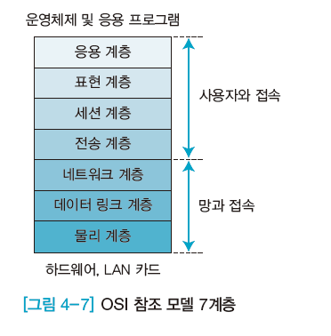
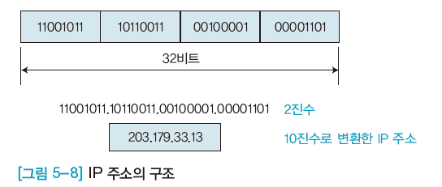
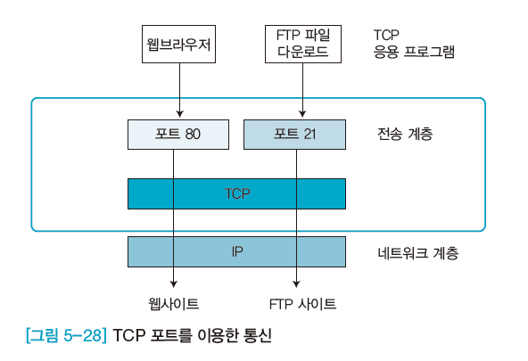
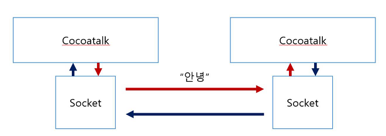

# Web Server Programming

세계에서 가장 많은 개발자가 웹서버 프로그래머

웹개발: 가시화. 웹프로그램 아키텍처가 페이지 개념의 프로그래밍 방식이라 진입장벽이 낮다.


## 01. OSI 참조 모델

### 개요

dependency를 줄이는 것이 관건

하드웨어에 의존적인 것을 소프트웨어 의존적으로 만들어, 표준화된 API를 가지고 작업할 수 있게끔 작업하자 = OSI(Open System Interconnection) model

통신 기술의 도입과 통신 기능의 확장을 쉽게 하려고 프로토콜을 몇 개의 계층으로 나누는 것을 ‘계층화’라 하고, 통신 기능을 7계층으로 분류하여 각 계층마다  프로토콜을 규정한 규격 = OSI model

### 데이터 전송



데이터 송신은 물리계층->응용계층, 데이터 수신은 응용계층->물리계층이다.

7개 계층은 서로 독립적

localhost는 망과 접속하기 전까지 갔다가 돌아오는 경로이다. (물리계층->네트웍계층->물리계층)

#### 전송 계층 Transport Layer

- 프로토콜(TCP, UDP)과 관련된 계층으로 오류 복구와 흐름 제어 등을 담당하며, 두 시스템 간에 신뢰성 있는 데이터를 전송한다.

- 또한 네트워크 계층에서 온 데이터를 세션 계층의 어느 애플리케이션에 보낼 것인지 판독하고, 네트워크 계층으로 전송할 경로를 선택한다.

- OSI 참조 모델 7계층 중 전송 계층은 네 번째 게층으로 시스템 종단 간에 투명한 데이터를 양방향으로 전송하는 계층이다.

- 네트워크 계층에서 전송한 데이터와 실제 운영체제의 프로그램이 연결되는 통신 경로라고 할 수 있다.

TCPIP의 핵심. 다른 컴퓨터로 보내는 역할. 전송계층에서 IP 정의

IP는 global하게 전 지구상 컴퓨터를 구분하겠다는 컨셉

컴퓨터 고유 주소는, 랜카드에 부여된 주소는 mac address. 고유 주소. -> 유일한 식별 번호

랜카드 주소를 다른쪽으로 어디든지 연결할 수 있지만, 구조가 복잡.

lan address로 통신하는 게 아니고, 상위 단계인 TCP으로 통신하고 있다.

IP로 컴퓨터와 컴퓨터를 구분한다.


- TCP (Transmission Control Protocol)는 송신지에서 수신지까지 문자 스트림을 전송하는데, 두 응용 계층이 서로 대화하는 것을 허용하는 신뢰성있는 프로토콜이다.

TCPI의 성능은 OSI 참조 모델의 전송 계층보다 뛰어나다.

TCP: 정확하게 수신자가 받게 한다. 대신 상대적으로 느림

- UDP(User Datagram Protocol)는 OSI 참조 모델에서 정의하는 전송 계층의 일부역할을 무시하는 단순한 전송 프로토콜이다.

UDP는 TCP에 비해 신뢰성이 낮으며, 흐름 제어 및 오류 검출등의 기능이 없어 패킷을 빠르게 전송해야하는 응용 계층에서 사용한다.

신뢰성이 없다고 해서 데이터가 중간에 바뀌는 것은 아니다 단지 빠트릴 수도.

UDP: 신뢰성이 없는 프로토콜. 데이터를 보내면, 보내기만 하고 책임 안 져. 데이터를 보내면 기본적으로 받는 사람이 잘 받았는지 안받았는지 몰라, 중간에 혼신될 가능성이 있다. like 우편시스템.

속도가 매우 고속이다. 요즘 안 쓰는 이유는 네트웍이 많이 빨라졌고 신뢰성 있는 전송이 중요해서. UDP보다 TCP를 사용한다.

#### 응용 계층

- 응용 계층과 사용자(사람 또는 소프트웨어), 표현 계층 간의 관계를 보여준다.

소프트웨어 간 통수신.

ex) 브라우저웹, 이메일, ...

응용 계층 데이터 단위: 메시지

나름대로 포맷을 가진다.

수신자는 문법에 맞춰 디코딩하고 데이터를 확인한다.


IP 위에 응용계층이 있다. 응용계층 like 개별적으로 돌아가는 프로그램


포트번호 필요. 없으면 응용 계층으로 데이터를 보낼 수 없다

well-known port : http(80), ...


- 인터넷 모델의 응용 계층에 포함되어 있는 프로토콜 일곱 개와 프로그램은 원격으로 컴퓨터 자원에 접속하는데 사용한다.
- 응용 프로그램들로 제공되는 서비스는 표현계층과 세션계층에서 정의하고 있다.

우리가 아는 모든 프로토콜은 응용계층이다.

ex) SMTP, FTP, 텔넷, DNS, SNMP, NFS, TFTP, ... : 세션계층, 표현계층, 응용계층을 다 포함한다.


### TCP/IP address

#### TCP/IP 주소의 구조

- 물리 주소
  - 물리 주소(MAC 주소)는 링크 주소 또는 통신망에서 정의된 노드의 주소, 이더넷 네트워크 인터페이스 카드(NIC) 6바이트(48비트) 주소 등을 말한다.
- 인터넷 주소
  - 인터넷에서는 기존 물리 주소와는 별도로 각 호스트를 식별할 수 있는 유일한 주소를 지정해야 한다.
- 포트 주소
  - 수신지 컴퓨터까지 전송하려면 IP 주소와 물리주소가 필요하다.
  - 인터넷통신의 최종목적은 한 프로세스가 다른 프로세스와 통신할 수 있도록 하는 것이다.


#### IP (Internet Protocol)

인터넷에 연결된 모든 컴퓨터에는 고유의 주소가 부여되는데, 이를 'IP 주소'라고 한다.

- 현재 사용하는 IP 주소 체계는 IP Ver. 4이다.
- IP 주소는 8비트 크기의 필드 네 개를 모아서 구성한 32비트(4바이트) 논리 주소이다.
- ×××.×××.×××.×××, 즉 163.152.19.114처럼 .(점)으로 구분한 10진수 형태 네 개로 구성된다.
- 한 바이트가 가질 수 있는 10진수는 0~255이므로, IP 주소의 값은 0.0.0.0에서 255.255.255.255까지이다.




#### TCP (Transmission Control Protocol)

포트 번호

- 포트는 TCP가 상위 계층으로 데이터를 전달하거나 상위 계층에서 TCP로 데이터를 전달할 때 상호 간에 사용하는 데이터의 이동 통로를 말한다.

- 통신할 때 여러 웹사이트에서 파일을 동시에 다운로드할 수 있다.

- 파일을 동시에 다운로드할 수 있는 이유는 TCP 프로토콜이 포트를 여러 개 사용해서 상위계층의 프로그램과 각각 따로 통신하기 때문이다.

- TCP 포트범위는 0~65,534까지의 정수다.

8bit = 1byte=0~255이므로, TCP 포트 범위는 0~65534(=16bit) 이다.



# Python Socket programming 

웹을 이해하는 관점에서 간단하게 볼 것이다.

웹서버를 간단하게 만들 것이다.


Application -------------Socket------------ Transport

socket: 데이터를 보내고 받는 표준화된 API



방식: 실제로 통신하는 것은 소켓들이 하며, cocoatalk 자체는 외부 네트워크와 아무런 정보도 주고받지 않는다.

## Web Service

- 웹 서버는 웹 클라이언트로부터 전송되어 오는 서비스 요청에 대한 결과인 HTML문서를 해당 웹 클라이언트에 제공
- 웹브라우저: HTML로 작성된 하이퍼텍스트 문서를 해석하여 화면에 출력
- 가장 대표적인 웹 서버로 아파치 사용
  - 안정성, 확장성을 고려한 OpenSource 프로젝트

### HTTP Protocol

HyperText Transfer Protocol

- 웹에서 정보를 주고 받을 수 있는 가장 기본적인 프로토콜(1996)
- HTML 포맷을 사용한 text 및 멀티미디어 자료 공유
- TCP(80번port) 프로토콜을 사용한 응용 계층
- http:로 시작하는 URL을 통해 접속
- 대규모 접속을 지원하기 위한 접속을 유지하지 않는 stateless 프로토콜
- 클라이언트와 서버 사이에 이루어지는 요청/응답 프로토콜

### HTTP Method (GET/POST)

- 웹서버에요청하는방식
  - 웹서버에클라이언트의data를전송하기위한전송방법
  - GET과POST는전달하는방식에서차이가있음
- GET 방식: URL을통해data 전송
  - GET방식으로전송할수있는data크기는한계가있음
  - 전송URL이노출됨
  - http://xxx/service?name1=value1&name2=value2
  - GET /service?name1=value1&name2=value2
  - Host : xxx
- POST 방식:Body를통해data 전송
  - 길이제한이없음
  - POST /service HTTP/1.1
  - Host : xxx
  - name1=value1&name2=value2


- server.py

```python
import socket

server_socket = socket.socket(socket.AF_INET, socket.SOCK_STREAM)  
#소켓이 꼭 TCPIP만 의미하는 것은 아니고 여러가지 통신방법이 있다.
#파라미터가 두 개 - 첫번째는 IP를 쓰겠다
#두번째는 TCP/UCP인데 STREAM은 TCP방법을 쓰겠다

server_socket.bind(('localhost', 12345))    #IP, 포트번호
server_socket.listen(0)                     #포트번호를 listening. 동시에 연결할 최대 소켓 갯수. 0은 automatically
#대기모드
print('listening...')

client_socket, addr = server_socket.accept() #클라이언트 접속될 때까지는 대기상태
print('accepting')
data =client_socket.recv(65535) #클라이언트 접속이 되면 데이터를 읽어들임.
#데이터는(패킷은) 최대 64k. 더 작을수도 클 수도 있는데, 크면 쪼개서 전송된다.

print('receive >> ' + data.decode())  #unicode to 한글

client_socket.send(data)
print('send data')
client_socket.close()
print('종료')
```

- client.py

```python
import socket

sock = socket.socket(socket.AF_INET, socket.SOCK_STREAM)

sock.connect(('localhost', 12345))
print('서버접속성공')

sock.send('hello'.encode())
print('send message')

data=sock.recv(65535)
print('receive >> '+ data.decode())
print('종료')
```

데이터 보내기

- server.py 실행 후 client.py 실행하면

```python
#result of server.py
listening...
accepting
receive >> hello
send data
종료

#result of client.py
서버접속성공
send message
receive : hello
종료
```


주로 server 다룰 것.

## Simple HTTP server

- server.py

```python
#simple http server
server_socket = socket.socket(socket.AF_INET, socket.SOCK_STREAM)

server_socket.bind(('localhost', 80))
server_socket.listen(0)
print('listening...')
client_socket, addr = server_socket.accept()
print('accepting')
data =client_socket.recv(65535)

print('receive >> ' + data.decode())
client_socket.close()
```

- 브라우저 요청 후 result

```python
#result of server.py
listening...
accepting
receive : GET / HTTP/1.1	#http protocol version
Host: localhost
Connection: keep-alive
Upgrade-Insecure-Requests: 1
User-Agent: Mozilla/5.0 (Windows NT 10.0; Win64; x64) AppleWebKit/537.36 (KHTML, like Gecko) Chrome/80.0.3987.87 Safari/537.36
Sec-Fetch-Dest: document
Accept: text/html,application/xhtml+xml,application/xml;q=0.9,image/webp,image/apng,*/*;q=0.8,application/signed-exchange;v=b3;q=0.9
Sec-Fetch-Site: none
Sec-Fetch-Mode: navigate
Sec-Fetch-User: ?1
Accept-Encoding: gzip, deflate, br
Accept-Language: ko-KR,ko;q=0.9,en-US;q=0.8,en;q=0.7
Cookie: _xsrf=2|941111c3|0f22749ff2b52f9ef56937eca9661be6|1580775110; username-localhost-8889="..."; username-localhost-8888="..."
```

```python
#result of browser
페이지가 작동하지 않습니다.localhost에서 전송한 데이터가 없습니다.
ERR_EMPTY_RESPONSE
```

### GET/POST method

- form.html

```html
<form action="http://127.0.0.1/" method=post>
    <input type=text name=id>    <!--name 속성이 있는 데이터만 서버로 보내-->
    <input type=submit value="send">
</form>
```

- get method - header에 저장

```bash
listening...
accepting
receive >> GET /?id=hello HTTP/1.1
```

- post ,method - body에 저장

```bash
listening...
accepting
receive >> POST / HTTP/1.1
...
...
...
id=hello
```

### HTTP

```python
client_socket.send('HTTP/1.0 200 0K\r\n\r\nHello'.encode('utf-8'))
```

HTTP 규약 : HTML 버전, 에러코드, OK, 엔터코드 2개

send 함수 인풋은 무조건 byte data여야 한다.


buffer(임시메모리) : 어느정도 차면 그때 데이터를 보내. 굳이 그때그때 보내지 않아. (IOA 효율성 향상)

```python
#html file load
server_socket = socket.socket(socket.AF_INET, socket.SOCK_STREAM)

server_socket.bind(('localhost', 80))
server_socket.listen(0)
print('listening...')

if True :           #while True : 테스트 할 때는 1회접속이 편리
    client_socket, addr = server_socket.accept()
    print('accepting')
    data =client_socket.recv(65535)
    data = data.decode()

    headers = data.split("\r\n")
    filename = headers[0].split(" ")[1]
    
    header = 'HTTP/1.0 200 0K\r\n\r\n'
    file = open('.'+filename, 'rt', encoding='utf-8')
    html = file.read()

    client_socket.send((header+html).encode('utf-8'))
    client_socket.close()    #HTTP의 특성. 접속하고 끊어버린다.
```


cf) 아래 두 줄을 `html = open('.'+filename, 'rt', encoding='utf-8').read()` 로 하면 안 되더라

```python
file = open('.'+filename, 'rt', encoding='utf-8')
html = file.read()
```


- file 다루기

```python
filename = '/index.html'
text = open('.'+filename, 'rt', encoding='utf-8').read()
#2nd param: read, write, binary, textflie
print(text)
```

`./filename` : current folder


서버사이드 프로그램: 파이썬 텍스트를 서버에 전송, 서버에서 파이썬 코드를 실행, 결과를 가져와 리턴

- 최종 test.py

```python
#확장자 나누기 + threading
def httpprocess(client_socket) :
    data =client_socket.recv(65535)
    data = data.decode()
    print(data)

    try:    
        headers = data.split("\r\n")
        filename = headers[0].split(" ")[1]
        _, ext = os.path.splitext(filename)

        group_a = ['.html', '.htm']
        group_b = ['.jpg', '.jpeg', '.png', '.bmp']

        
        if '.py' in filename:
            html = subprocess.check_output(['python.exe', '.'+filename])
            html = html.decode('cp949')
            header = 'HTTP/1.0 200 0K\r\n\r\n'
            client_socket.send((header+html).encode('utf-8'))
        elif ext in group_a :
            file = open('.'+filename, 'rt', encoding='utf-8')
            html = file.read()
            header = 'HTTP/1.0 200 0K\r\n\r\n'
            client_socket.send((header+html).encode('utf-8'))
        elif ext in group_b or ext == '.ico' :
            client_socket.send('HTTP/1.1 200 OK\r\n'.encode())
            client_socket.send("Content-Type: image/png\r\n".encode())
            client_socket.send("Accept-Ranges: bytes\r\n\r\n".encode())
            file = open('.' + filename, 'rb')
            client_socket.send(file.read())  #binary type
            file.close()
        else :
            header = 'HTTP/1.0 404 File Not Found\r\n\r\n'
            client_socket.send((header+html).encode('utf-8'))
    except Exception as e:
        print(e)
    client_socket.close()


server_socket = socket.socket(socket.AF_INET, socket.SOCK_STREAM)

server_socket.bind(('localhost', 80))
server_socket.listen(0)
print('listening...')

while True :
    client_socket, addr = server_socket.accept()
    client_socket.settimeout(3)
    print('accepting')
    t = threading.Thread(target=httpprocess, args=(client_socket,))
    t.start()
```

## python과 html 코딩

코드를 섞어쓰면 불편하다.

같은 파일에서 동작하도록 -> template 기능 사용

- test2.py

```python
html = """
<html>
   <head>
      <meta charset="utf-8">
   </head>

   <body>
       <font color=red> @out</font>
   </body>
</html>
"""

html = html.replace("@out",  "제목출력")
#template engine에서 실시간으로 바꿔준다.

print(html)
```

`127.0.0.1/test2.py` 들어가면 `제목출력` 이 출력된다.

(200212)

# HTML

HTTP Method: 웹서버에 요청하는 방식

요청-응답(무조건 html)

- HTML = Hyper Text Markup Language

hyper: 건너 편의, 초월, 과도한

한 문서에서 다른 문서로 건너뛸 수 있는 텍스트.


- 문서의 구조

기존 문서: 순차적, 서열형 구조

하이퍼텍스트 : 링크에 따라 그 차례가 바뀌는 임의적이면서 나열형 구조

책과는 완전 다른 컨셉으로, 하이퍼링크로 연결된 문서들을 어떠한 행위(click)에 따라 자유롭게 이동


- Tags

opening tags + closing tags 인데 closing tags가 없는 경우도 많다.

- CSS

사용 이유: 명확성, 확장성, 유지보수 편의성으로 template과 같은 컨셉으로 분리하는 것이다.


오늘 >> 스마트폰으로 촬영 - 업로드 - YOLO - 게시물처럼 관리, 리스트화

AWS 포트 두개씩 필요. 하나는 주피터노트북, 하나는 서버


- 모바일 지원 HTML
  
  - 모바일 viewport 지원
  
  ```html
  <head>
      <meta charset='utf-8'>
      <meta name='viewport' content='width=device-width, initial-scale=1.0'>
  </head>
  ```
  
  스마트폰에 맞춰서 scaling
  
  - 모바일 camera 지원
  ```html
  <input type='file' name='file1' accept='image/*' capture='camera'>
  ```


- python web server 구축
  - SimpleHTTPServer

  ```python
  python -m http.server 9000
  ```

  - 스크립트 기반 웹서버
  - Web Framework 기반 웹서버
    - Flask : 경량 웹서버. 정말 기능이 없다
    - Django : MVC 기반의 웹서버


## Template 기반 Flask : 변수 공유

### render_template

- .py

```python
from flask import Flask, render_template
app = Flask(__name__)

@app.route('/')
def index():
    return render_template('home.html', htmlvariable=pyvariable)
```

- .html

HTML에서 파이썬의 객체에 접근하려면 `{{변수}}` 를 사용한다.

``,` ` 사용해 반복처리

```html
<!--예시-->
<ul>
    
    <li>이름은 {{s}}</li>
    
</ul>
```

#### 공유할 변수가 여러 개일 경우

딕셔너리의 리스트로 자료를 저장한다.

[ {}, {}, ...]

```python
#DB
lista = ["book2.jpg", "dog.jpg", "single.jpeg"]
listb = ['책데이터', '개영상테스트', '사람']
# 여러 리스트를 딕셔너리로 합치기
listData = []
id = []
for i in range(len(lista)):
    id.append(int(i))
    listData.append({'id': id[i], 'img': lista[i], 'title': listb[i]})
```

#### 갤러리와 이미지 디테일

- gallery.html

```python
@app.route('/image')
def image():
    return render_template('image.html', listData=listData)
```

```html
<table border="5">
    
    <tr>
        <td><a href="/view?id={{s.id}}"></a></td>
        <td>{{s.title}}</td>
    </tr>
    
</table>
```

- view.html (이미지 상세보기)

```python
@app.route('/view')
def view():
    localid = request.args.get('id')
    return render_template('view.html', s=listData[int(localid)])
```

```html
<font size="20">{{s.title}}</font>
<br>

<br>
<a href="/image"><font size="10">목록으로</font></a>
```


### file-upload form

- gallery.html

```html
<form action = "/fileUpload" method="POST" enctype="multipart/form-data">
    <input type="file" name="file1"><br>
    제목 : <input type="text" name="title">
    <input type="submit" value="전송">
</form>
```

메소드는 POST 필수

enctype 설정도 필수. 부가적인 데이터도 같이 전송되기 때문에 multipart

- .py

```python
@app.route('/fileUpload', methods=['POST'])
def fileUpload() :
    if request.method == 'POST' :                  #파일 업로드는 POST 방식만 가능
        f =request.files['file1']                  #form에서의 변수
        f.save('./static/downloads/' + f.filename)  #서버의 실제 물리적인 폴더 경로
        title = request.form.get('title')
        return '업로드 완료'
```


### javascript로 리턴

```python
def goURL(msg, url) :
    html = f"""
<script>
    alert("@msg")
    window.location.href = "@url"
</script>
    """ #위의 html은 단지 문자열일 뿐이다. 서버에서는 문자열을 리턴하고, 브라우저에서 html을 디코딩한다.
    html = html.replace("@msg", msg)
    html = html.replace("@url", url)
    return html


@app.route('/fileUpload', methods=['POST'])
def fileUpload() :
    if request.method == 'POST' :                  #파일 업로드는 POST 방식만 가능
        f =request.files['file1']                  #form에서의 변수
        f.save('./static/' + f.filename)  #서버의 실제 물리적인 폴더 경로
        title = request.form.get('title')

        id = len(listData)
        listData.append({'id':id, 'img':f.filename, 'title':title})
    return goURL("업로드가 성공했습니다.","/image")
```

