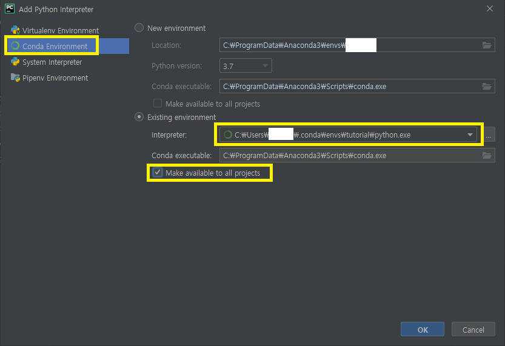
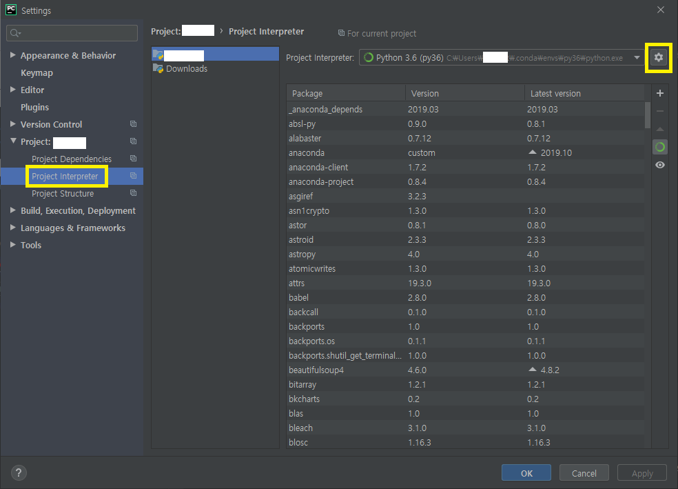
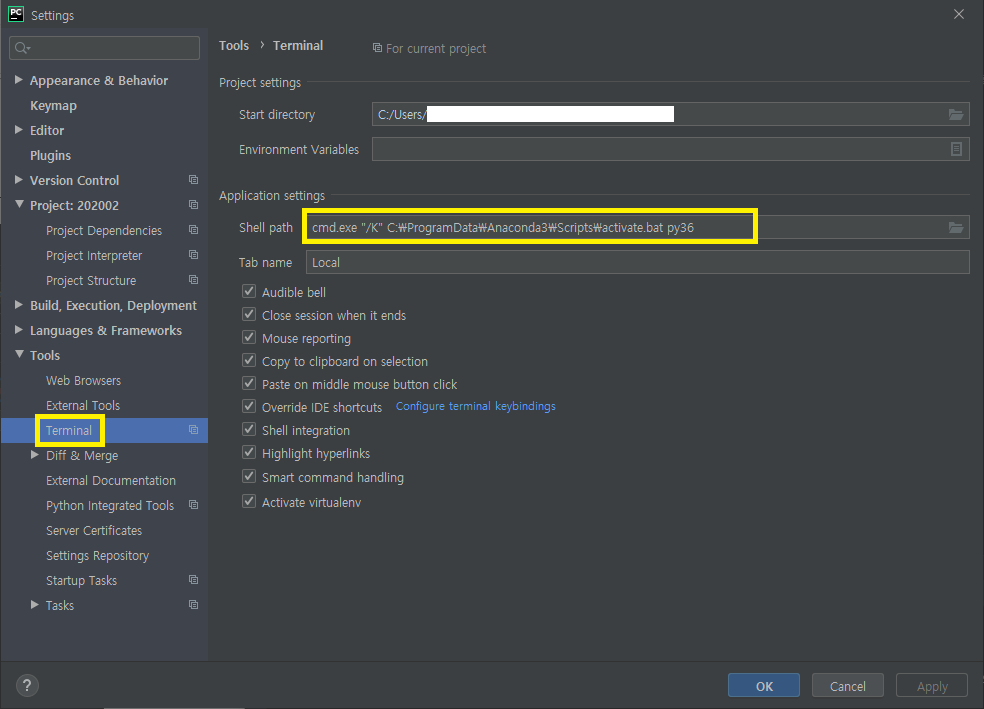

Anaconda 설치 후 Pycharm Virtual Enviroment 연동하기

## Setting - 1

Configure -> Settings

Project Interpreter -> Conda Environment -> New environment 클릭

`C:\Users\<사용자명>\Anaconda3\envs\가상환경이름`

## Setting - Terminal

Terminal에서 Virtual ENV 쓰도록 설정하기

`cmd.exe "/K" C:\Users\사용자명\Anaconda3\Scripts\activate.bat 가상환경이름`

